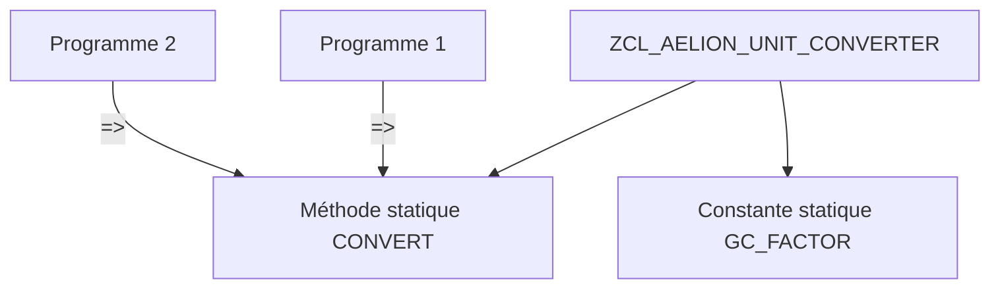

# 🌸 COMPOSANTS STATIQUES

## 🌺 OBJECTIFS

- [ ] Identifier les attributs et méthodes statiques dans `SE24`.
- [ ] Utiliser le sélecteur `=>`.
- [ ] Comprendre l’état partagé.
- [ ] Choisir entre méthode statique et méthode d’instance.

## 🌺 DÉFINITION

Un composant statique appartient à la classe et non à une instance particulière. Il est accessible sans créer d’objet.

## 🌺 VUE D'ENSEMBLE



## 🌺 CRÉATION DANS SE24

Dans l’onglet **Méthodes**, sélectionner le niveau statique pour `CONVERT_KG_TO_G`.

```abap
METHOD convert_kg_to_g.
  rv_grams = iv_kilograms * 1000.
ENDMETHOD.
```

Appel :

```abap
DATA(lv_grams) = zcl_aelion_unit_converter=>convert_kg_to_g(
  iv_kilograms = '2.5' ).
```

> [!WARNING]
> Une méthode statique ne doit pas être choisie uniquement pour éviter l’instanciation. Elle convient lorsque le traitement ne dépend d’aucun état propre à un objet.

## 🌺 COMPARAISON

| Question                                          | Instance | Statique |
| ------------------------------------------------- | -------: | -------: |
| Dépend d’un état propre à l’objet                 |      Oui |      Non |
| Nécessite `NEW`                                   |      Oui |      Non |
| Appel                                             |     `->` |     `=>` |
| Peut être substituée par polymorphisme d’instance |      Oui |   Limité |

## 🌺 CAS ADAPTÉS

- conversion pure ;
- validation sans état ;
- fabrique contrôlant la création d’objets ;
- accès à une constante publique.

## 🌺 EXERCICE

Créer `ZCL_AELION_TEXT_UTIL` avec une méthode statique `TO_UPPER` retournant une chaîne en majuscules.

<details>
<summary>Afficher la correction et les points de contrôle</summary>

- [ ] Aucune instance n’est créée.
- [ ] L’appel utilise =>.
- [ ] La méthode ne dépend pas d’un attribut d’instance.
- [ ] Le résultat est retourné par RETURNING.

</details>

## 🌺 RÉSUMÉ

> - Les composants statiques existent au niveau de la classe.
> - Ils sont appelés avec `=>`.
> - L’état statique est partagé dans la session interne.
> - Les méthodes d’instance restent préférables lorsqu’un état ou un polymorphisme est nécessaire.

## 🌺 SOURCES OFFICIELLES

- [Documentation SAP — Classes](https://help.sap.com/doc/abapdocu_cp_index_htm/CLOUD/en-US/ABENCLASSES.html)
