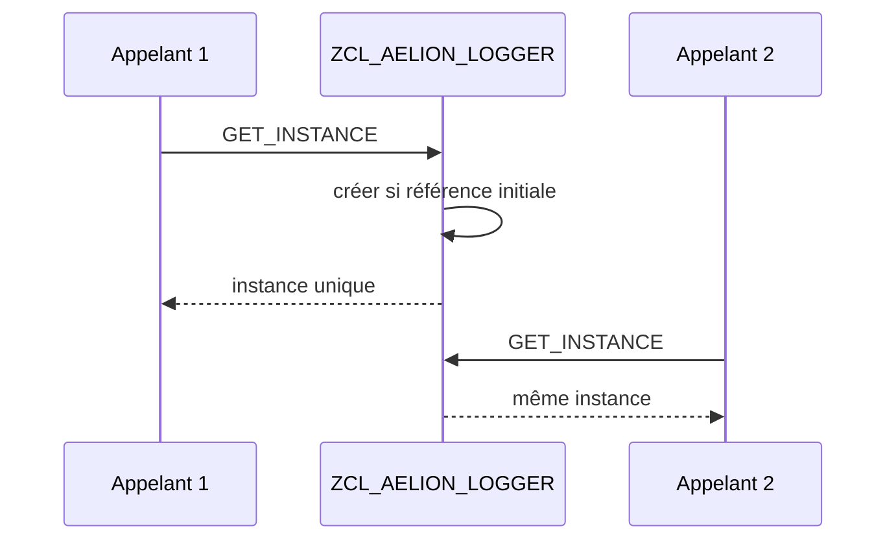

# 🌸 SINGLETON DANS SE24

## 🌺 OBJECTIFS

- [ ] Comprendre le but du pattern Singleton.
- [ ] Configurer une instanciation privée dans `SE24`.
- [ ] Créer une méthode statique `GET_INSTANCE`.
- [ ] Identifier les limites du pattern.

## 🌺 DÉFINITION

Un Singleton garantit qu’une classe contrôle elle-même la création de son instance et retourne la même référence pendant une session interne.

## 🌺 VUE D'ENSEMBLE



## 🌺 CONFIGURATION DANS SE24

1. Créer `ZCL_AELION_LOGGER`.
2. Dans les propriétés, choisir une instanciation **privée**.
3. Créer l’attribut statique privé `GO_INSTANCE`, type référence vers `ZCL_AELION_LOGGER`.
4. Créer la méthode statique publique `GET_INSTANCE`.
5. Définir un paramètre Returning `RO_INSTANCE`, type référence vers la classe.

```abap
METHOD get_instance.
  IF go_instance IS NOT BOUND.
    go_instance = NEW zcl_aelion_logger( ).
  ENDIF.

  ro_instance = go_instance.
ENDMETHOD.
```

Appel :

```abap
DATA(lo_logger) = zcl_aelion_logger=>get_instance( ).
lo_logger->add_message( iv_text = 'Traitement démarré' ).
```

> [!CAUTION]
> Un Singleton crée un état global implicite. Il complique les tests et augmente le couplage lorsqu’il est utilisé sans nécessité réelle.

## 🌺 QUAND L’UTILISER

Cas possible : gestionnaire technique unique dans une session, cache contrôlé ou fabrique centralisée.

Ne pas l’utiliser pour partager arbitrairement des données métier entre traitements.

## 🌺 EXERCICE

Créer `ZCL_AELION_SETTINGS` en instanciation privée et vérifier que deux appels à `GET_INSTANCE` retournent la même référence.

<details>
<summary>Afficher la correction et les points de contrôle</summary>

- [ ] L’instanciation est privée dans les propriétés SE24.
- [ ] GO_INSTANCE est statique et privé.
- [ ] GET_INSTANCE est statique et public.
- [ ] La création n’a lieu que si GO_INSTANCE n’est pas liée.

</details>

## 🌺 RÉSUMÉ

> - La classe contrôle sa propre instanciation.
> - `GET_INSTANCE` retourne toujours la référence mémorisée.
> - L’instanciation privée empêche `NEW` depuis l’extérieur.
> - Le pattern doit rester exceptionnel et justifié.

## 🌺 SOURCES OFFICIELLES

- [Documentation SAP — Singleton](https://help.sap.com/doc/abapdocu_latest_index_htm/latest/en-US/ABENSTATIC_CLASS_SINGLETON_GUIDL.html)
- [Documentation SAP — Constructor](https://help.sap.com/doc/abapdocu_cp_index_htm/CLOUD/en-US/ABENCONSTRUCTOR.html)
