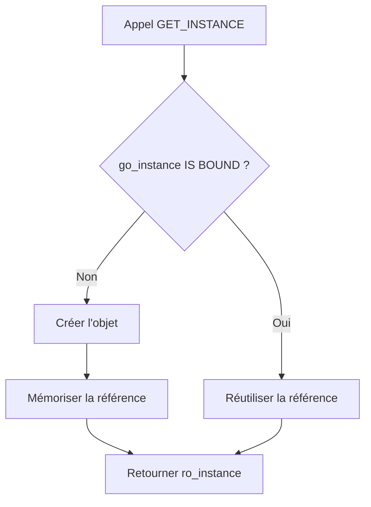

# 🌸 SINGLETON

## 🌺 OBJECTIFS

- [ ] Comprendre le besoin d’une instance unique
- [ ] Empêcher l’instanciation extérieure avec `CREATE PRIVATE`
- [ ] Stocker l’instance dans un attribut statique privé
- [ ] Fournir une méthode statique `GET_INSTANCE`
- [ ] Vérifier que plusieurs appels retournent le même objet

## 🌺 DEFINITION

> Le `SINGLETON` est un patron de conception qui contrôle la création d’une classe afin de fournir une seule instance partagée dans le contexte d’exécution.

Il repose généralement sur :

1. une création privée ;
2. une référence statique privée ;
3. une méthode statique publique retournant l’instance.

## 🌺 STRUCTURE

    CLASS lcl_configuration DEFINITION CREATE PRIVATE.
      PUBLIC SECTION.
        CLASS-METHODS get_instance
          RETURNING
            VALUE(ro_instance) TYPE REF TO lcl_configuration.

      PRIVATE SECTION.
        CLASS-DATA go_instance TYPE REF TO lcl_configuration.
    ENDCLASS.

## 🌺 LOGIQUE GET_INSTANCE

    METHOD get_instance.
      IF go_instance IS NOT BOUND.
        go_instance = NEW lcl_configuration( ).
      ENDIF.

      ro_instance = go_instance.
    ENDMETHOD.

Premier appel :

- la référence statique est initiale ;
- l’objet est créé ;
- sa référence est mémorisée.

Appels suivants :

- la référence est déjà liée ;
- aucun nouvel objet n’est créé ;
- la même référence est retournée.

## 🌺 EXEMPLE COMPLET

    REPORT zaelion_oo_11.

    CLASS lcl_configuration DEFINITION CREATE PRIVATE.
      PUBLIC SECTION.
        CLASS-METHODS get_instance
          RETURNING
            VALUE(ro_instance) TYPE REF TO lcl_configuration.

        METHODS set_environment
          IMPORTING
            iv_environment TYPE string.

        METHODS get_environment
          RETURNING
            VALUE(rv_environment) TYPE string.

      PRIVATE SECTION.
        CLASS-DATA go_instance TYPE REF TO lcl_configuration.
        DATA mv_environment TYPE string.
    ENDCLASS.

    CLASS lcl_configuration IMPLEMENTATION.
      METHOD get_instance.
        IF go_instance IS NOT BOUND.
          go_instance = NEW lcl_configuration( ).
        ENDIF.

        ro_instance = go_instance.
      ENDMETHOD.

      METHOD set_environment.
        mv_environment = iv_environment.
      ENDMETHOD.

      METHOD get_environment.
        rv_environment = mv_environment.
      ENDMETHOD.
    ENDCLASS.

    START-OF-SELECTION.

      DATA(lo_configuration_1) = lcl_configuration=>get_instance( ).
      DATA(lo_configuration_2) = lcl_configuration=>get_instance( ).

      lo_configuration_1->set_environment( iv_environment = 'DEV' ).

      WRITE: / lo_configuration_2->get_environment( ).

      IF lo_configuration_1 = lo_configuration_2.
        WRITE: / 'Même instance'.
      ENDIF.

## 🌺 RESULTAT ATTENDU

    DEV
    Même instance

La valeur définie par la première référence est visible depuis la seconde, car les deux références pointent vers le même objet.

## 🌺 DIAGRAMME

## 🌺 POURQUOI CREATE PRIVATE

    CLASS lcl_configuration DEFINITION CREATE PRIVATE.

Cette option empêche le programme extérieur d’exécuter :

    " ERREUR : création privée
    DATA(lo_configuration) = NEW lcl_configuration( ).

La classe elle-même conserve le droit de créer son instance dans `GET_INSTANCE`.

## 🌺 CAS D'USAGE POSSIBLES

- configuration partagée ;
- accès centralisé à un cache ;
- fabrique ou registre unique ;
- service technique dont l’unicité est réellement requise.

## 🌺 LIMITES

Le singleton introduit un état partagé globalement accessible.
Il peut compliquer :

- les tests unitaires ;
- le remplacement d’une dépendance ;
- l’exécution parallèle ;
- la compréhension des modifications d’état.

> [!WARNING]
> Le singleton ne doit pas être utilisé par défaut.
> Il doit répondre à une exigence réelle d’instance unique.

## 🌺 BONNES PRATIQUES

- Garder la référence singleton privée.
- Retourner l’instance uniquement par une méthode contrôlée.
- Eviter les données métier mutables dans un singleton.
- Documenter la durée de vie attendue de l’état.
- Préférer l’injection d’une instance lorsque l’unicité n’est pas obligatoire.

## 🌺 EXERCICES

1. Créer un singleton `lcl_application_log`.
2. Ajouter une table interne privée de messages.
3. Ajouter une méthode d’instance `add_message`.
4. Ajouter une méthode d’instance `get_messages`.
5. Récupérer deux fois le singleton.
6. Ajouter un message avec la première référence.
7. Lire les messages avec la seconde référence.

## 🌺 RESUME

> - Le singleton contrôle la création d’une instance unique.
> - `CREATE PRIVATE` interdit la création extérieure.
> - `CLASS-DATA` conserve la référence partagée.
> - `GET_INSTANCE` crée l’objet uniquement au premier appel.
> - Tous les appelants reçoivent ensuite la même instance.

## 🌺 SOURCES OFFICIELLES

- SAP Help — Singleton Classes : https://help.sap.com/docs/SUPPORT_CONTENT/abap/3353524225.html
- SAP ABAP Keyword Documentation — Class Creation Options : https://help.sap.com/doc/abapdocu_latest_index_htm/latest/en-US/abapclass_options.htm
