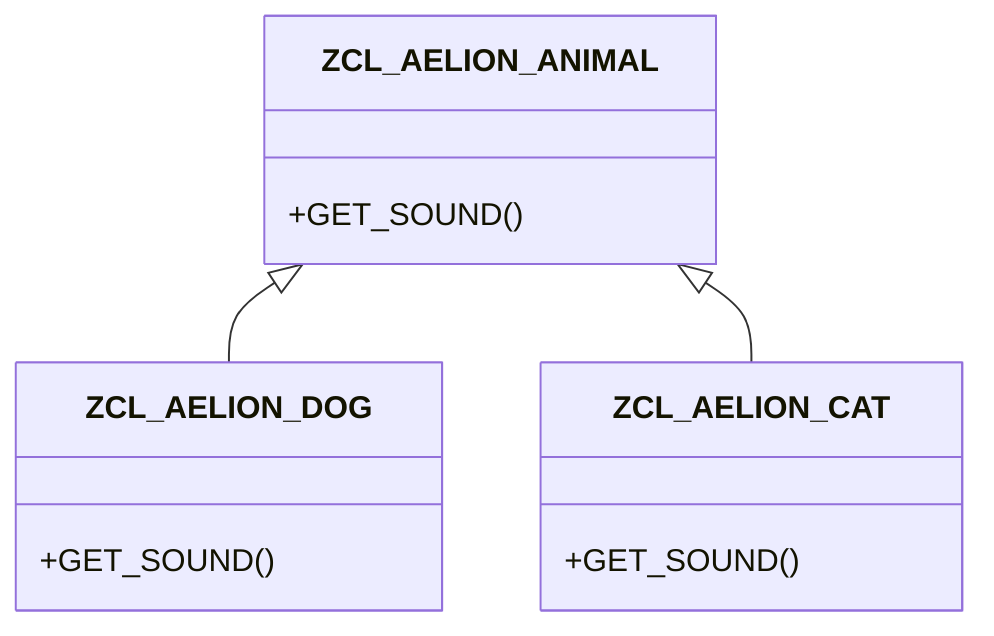

# 🌸 HÉRITAGE ET POLYMORPHISME

## 🌺 OBJECTIFS

- [ ] Définir une superclasse dans `SE24`.
- [ ] Créer une sous-classe globale.
- [ ] Redéfinir une méthode.
- [ ] Utiliser une référence de superclasse de manière polymorphe.

## 🌺 DÉFINITION

L’héritage permet à une sous-classe de reprendre les composants publics et protégés d’une superclasse. Le polymorphisme permet d’appeler la même méthode via un type commun tout en exécutant l’implémentation correspondant à l’objet réel.

## 🌺 VUE D'ENSEMBLE



## 🌺 CONFIGURATION DANS SE24

1. Créer `ZCL_AELION_ANIMAL` avec la méthode publique `GET_SOUND`.
2. Créer `ZCL_AELION_DOG` en indiquant `ZCL_AELION_ANIMAL` comme superclasse.
3. Dans la sous-classe, sélectionner la méthode héritée puis la redéfinir.
4. Répéter avec `ZCL_AELION_CAT`.

## 🌺 APPEL POLYMORPHE

```abap
DATA lo_animal TYPE REF TO zcl_aelion_animal.

lo_animal = NEW zcl_aelion_dog( ).
WRITE / lo_animal->get_sound( ).

lo_animal = NEW zcl_aelion_cat( ).
WRITE / lo_animal->get_sound( ).
```

La variable conserve le type de la superclasse, mais l’implémentation exécutée dépend de l’objet référencé.

> [!IMPORTANT]
> Utiliser l’héritage seulement lorsqu’une relation « est un » est stable. Pour un simple contrat commun entre classes indépendantes, préférer une interface.

## 🌺 ABSTRAIT ET FINAL

- une classe abstraite ne peut pas être instanciée directement ;
- une méthode abstraite doit être redéfinie par une sous-classe concrète ;
- une classe finale ne peut pas être héritée ;
- une méthode finale ne peut pas être redéfinie.

Ces propriétés sont configurées dans `SE24`.

## 🌺 EXERCICE

Créer une superclasse abstraite `ZCL_AELION_SHAPE` et deux sous-classes calculant une aire.

<details>
<summary>Afficher la correction et les points de contrôle</summary>

- [ ] La superclasse porte le contrat commun.
- [ ] Les sous-classes redéfinissent le calcul.
- [ ] Une référence de superclasse accepte les deux objets.
- [ ] Le choix entre interface et héritage est justifié.

</details>

## 🌺 RÉSUMÉ

> - L’héritage spécialise une classe existante.
> - La redéfinition adapte le comportement dans la sous-classe.
> - Le polymorphisme repose sur un type de référence commun.
> - Les interfaces sont souvent plus souples que l’héritage.

## 🌺 SOURCES OFFICIELLES

- [Documentation SAP — Classes](https://help.sap.com/doc/abapdocu_cp_index_htm/CLOUD/en-US/ABENCLASSES.html)
