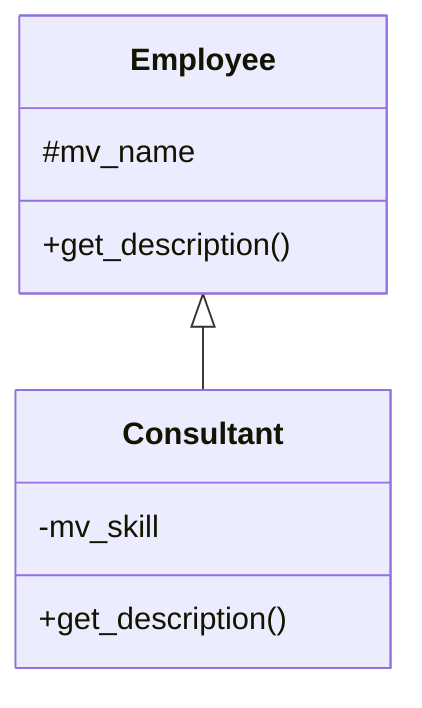

# 🌸 HERITAGE ET POLYMORPHISME

## 🌺 OBJECTIFS

- [ ] Comprendre la relation entre super-classe et sous-classe
- [ ] Déclarer une sous-classe avec `INHERITING FROM`
- [ ] Utiliser la visibilité `PROTECTED`
- [ ] Redéfinir une méthode avec `REDEFINITION`
- [ ] Appeler le constructeur de la super-classe
- [ ] Comprendre le polymorphisme

## 🌺 DEFINITION DE L'HERITAGE

> L’héritage permet de créer une classe spécialisée à partir d’une classe existante.

La classe existante est la `SUPER-CLASSE`.
La classe spécialisée est la `SOUS-CLASSE`.

    CLASS lcl_consultant DEFINITION
      INHERITING FROM lcl_employee.

## 🌺 EXEMPLE DE RELATION

Lecture textuelle :

- `lcl_consultant` hérite de `lcl_employee` ;
- le nom protégé est utilisable dans la sous-classe ;
- la sous-classe ajoute une compétence ;
- la méthode de description est redéfinie.

## 🌺 SUPER-CLASSE

    CLASS lcl_employee DEFINITION.
      PUBLIC SECTION.
        METHODS constructor
          IMPORTING
            iv_name TYPE string.

        METHODS get_description
          RETURNING
            VALUE(rv_text) TYPE string.

      PROTECTED SECTION.
        DATA mv_name TYPE string.
    ENDCLASS.

## 🌺 SOUS-CLASSE

    CLASS lcl_consultant DEFINITION
      INHERITING FROM lcl_employee.

      PUBLIC SECTION.
        METHODS constructor
          IMPORTING
            iv_name  TYPE string
            iv_skill TYPE string.

        METHODS get_description REDEFINITION.

      PRIVATE SECTION.
        DATA mv_skill TYPE string.
    ENDCLASS.

## 🌺 IMPLEMENTATION COMPLETE

    REPORT zaelion_oo_12.

    CLASS lcl_employee DEFINITION.
      PUBLIC SECTION.
        METHODS constructor
          IMPORTING
            iv_name TYPE string.

        METHODS get_description
          RETURNING
            VALUE(rv_text) TYPE string.

      PROTECTED SECTION.
        DATA mv_name TYPE string.
    ENDCLASS.

    CLASS lcl_consultant DEFINITION
      INHERITING FROM lcl_employee.

      PUBLIC SECTION.
        METHODS constructor
          IMPORTING
            iv_name  TYPE string
            iv_skill TYPE string.

        METHODS get_description REDEFINITION.

      PRIVATE SECTION.
        DATA mv_skill TYPE string.
    ENDCLASS.

    CLASS lcl_employee IMPLEMENTATION.
      METHOD constructor.
        mv_name = iv_name.
      ENDMETHOD.

      METHOD get_description.
        rv_text = |Employé : { mv_name }|.
      ENDMETHOD.
    ENDCLASS.

    CLASS lcl_consultant IMPLEMENTATION.
      METHOD constructor.
        super->constructor( iv_name = iv_name ).
        mv_skill = iv_skill.
      ENDMETHOD.

      METHOD get_description.
        rv_text = |Consultant : { mv_name } - Compétence : { mv_skill }|.
      ENDMETHOD.
    ENDCLASS.

    START-OF-SELECTION.

      DATA lo_employee TYPE REF TO lcl_employee.

      lo_employee = NEW lcl_consultant(
        iv_name  = 'Lina'
        iv_skill = 'ABAP' ).

      WRITE: / lo_employee->get_description( ).

## 🌺 SUPER

> `super` permet d’accéder à l’implémentation de la super-classe depuis une sous-classe.

    super->constructor( iv_name = iv_name ).

Cette instruction initialise la partie héritée de l’objet.

## 🌺 REDEFINITION

La super-classe déclare une méthode :

    METHODS get_description
      RETURNING VALUE(rv_text) TYPE string.

La sous-classe annonce sa redéfinition :

    METHODS get_description REDEFINITION.

La sous-classe fournit ensuite sa propre implémentation.

## 🌺 POLYMORPHISME

> Le polymorphisme permet à une référence de super-classe de désigner un objet d’une sous-classe.

    DATA lo_employee TYPE REF TO lcl_employee.
    lo_employee = NEW lcl_consultant( ... ).

L’appel suivant exécute l’implémentation redéfinie dans `lcl_consultant` :

    lo_employee->get_description( ).

Le type statique de la référence est `lcl_employee`.
Le type réel de l’objet est `lcl_consultant`.

## 🌺 FINAL ET ABSTRACT

Une classe finale ne peut pas être héritée :

    CLASS lcl_final_service DEFINITION FINAL.

Une classe abstraite ne peut pas être instanciée directement :

    CLASS lcl_document DEFINITION ABSTRACT.

Une méthode abstraite doit être implémentée par une sous-classe concrète :

    METHODS render ABSTRACT
      RETURNING VALUE(rv_text) TYPE string.

## 🌺 BONNES PRATIQUES

- Utiliser l’héritage uniquement pour une relation réelle « est un ».
- Préférer les attributs privés ; utiliser protected uniquement si la sous-classe en a besoin.
- Redéfinir une méthode pour spécialiser un comportement, pas pour contourner une mauvaise conception.
- Appeler le constructeur de la super-classe lorsque son initialisation est requise.
- Préférer une interface lorsque plusieurs classes sans parent naturel doivent partager un contrat.

## 🌺 EXERCICES

1. Créer une super-classe `lcl_document`.
2. Ajouter une méthode `get_title`.
3. Créer une sous-classe `lcl_invoice`.
4. Ajouter un numéro de facture.
5. Redéfinir une méthode `get_description`.
6. Manipuler l’objet facture avec une référence de type document.

## 🌺 RESUME

> - `INHERITING FROM` crée une sous-classe.
> - Une sous-classe hérite des composants autorisés de la super-classe.
> - `PROTECTED` est accessible dans les sous-classes.
> - `REDEFINITION` remplace le comportement hérité.
> - `super->` appelle l’implémentation de la super-classe.
> - Le polymorphisme sépare le type de la référence du type réel de l’objet.

## 🌺 SOURCES OFFICIELLES

- SAP ABAP Keyword Documentation — Inheritance : https://help.sap.com/doc/abapdocu_latest_index_htm/latest/en-US/abeninheritance.htm
- SAP ABAP Keyword Documentation — Inheritance and Visibility : https://help.sap.com/doc/abapdocu_latest_index_htm/latest/en-US/abeninheritance_visibility.htm
- SAP ABAP Keyword Documentation — Inheritance and Constructors : https://help.sap.com/doc/abapdocu_latest_index_htm/latest/en-US/abeninheritance_constructors.htm
