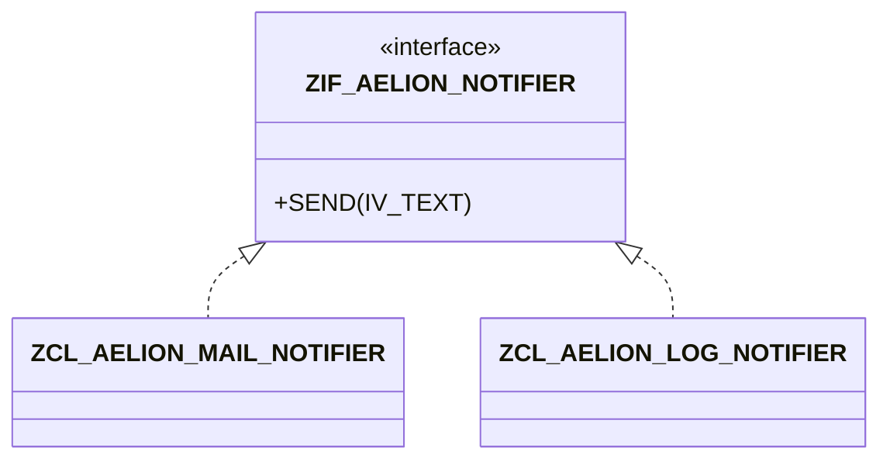

# 🌸 INTERFACES GLOBALES

## 🌺 OBJECTIFS

- [ ] Créer une interface globale avec `SE24`.
- [ ] Ajouter une méthode au contrat.
- [ ] Implémenter l’interface dans plusieurs classes.
- [ ] Utiliser une référence d’interface.

## 🌺 DÉFINITION

Une interface définit un contrat public sans fournir l’implémentation métier de ses méthodes. Plusieurs classes sans lien d’héritage peuvent implémenter le même contrat.

## 🌺 VUE D'ENSEMBLE



## 🌺 CRÉATION DANS SE24

1. Ouvrir `/nSE24`.
2. Saisir `ZIF_AELION_NOTIFIER`.
3. Sélectionner le type d’objet **Interface**, puis créer.
4. Ajouter la méthode `SEND` avec le paramètre d’import `IV_TEXT`.
5. Activer l’interface.

Dans `ZCL_AELION_MAIL_NOTIFIER`, ajouter l’interface dans l’onglet **Interfaces**, puis implémenter `ZIF_AELION_NOTIFIER~SEND`.

## 🌺 UTILISATION POLYMORPHE

```abap
DATA lo_notifier TYPE REF TO zif_aelion_notifier.

lo_notifier = NEW zcl_aelion_mail_notifier( ).
lo_notifier->send( iv_text = 'Message par e-mail' ).

lo_notifier = NEW zcl_aelion_log_notifier( ).
lo_notifier->send( iv_text = 'Message dans le journal' ).
```

> [!TIP]
> Le programme dépend de l’interface, pas de l’implémentation concrète. Cette séparation facilite les tests et le remplacement d’une classe.

## 🌺 BONNES PRATIQUES

- nommer les interfaces client avec un préfixe tel que `ZIF_` ;
- définir un contrat cohérent et stable ;
- éviter les interfaces trop larges ;
- préférer plusieurs interfaces ciblées à une interface générale difficile à implémenter.

## 🌺 EXERCICE

Créer `ZIF_AELION_EXPORTER` avec une méthode `EXPORT`, puis deux classes d’implémentation : texte et CSV.

<details>
<summary>Afficher la correction et les points de contrôle</summary>

- [ ] L’interface est un objet global créé dans SE24.
- [ ] Les deux classes implémentent la même méthode.
- [ ] Le programme utilise une référence TYPE REF TO ZIF\_...
- [ ] Aucun CAST inutile n’est requis pour appeler le contrat.

</details>

## 🌺 RÉSUMÉ

> - Une interface définit un contrat public.
> - Elle ne possède pas d’instance autonome.
> - Les classes fournissent les implémentations.
> - Une référence d’interface permet le polymorphisme entre classes indépendantes.

## 🌺 SOURCES OFFICIELLES

- [Documentation SAP — Interfaces](https://help.sap.com/doc/abapdocu_latest_index_htm/latest/en-US/ABENINTERFACES.html)
- [Documentation SAP — Builder](https://help.sap.com/doc/abapdocu_latest_index_htm/latest/en-US/ABENCLASS_BUILDER_GLOSRY.html)
