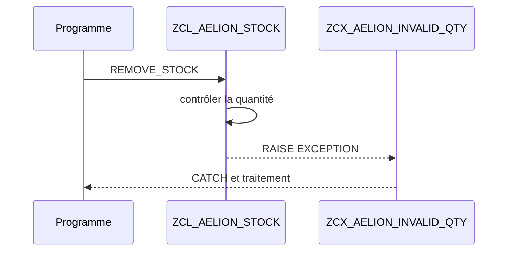

# 🌸 EXCEPTIONS DE CLASSE

## 🌺 OBJECTIFS

- [ ] Créer une classe d’exception globale.
- [ ] Déclarer une exception dans la signature d’une méthode.
- [ ] Lever l’exception avec `RAISE EXCEPTION`.
- [ ] La traiter avec `TRY...CATCH`.

## 🌺 DÉFINITION

Une exception de classe représente une situation anormale qu’un appelant doit pouvoir identifier et traiter. Les classes d’exception héritent généralement de `CX_STATIC_CHECK`, `CX_DYNAMIC_CHECK` ou `CX_NO_CHECK` selon la stratégie retenue.

## 🌺 VUE D'ENSEMBLE



## 🌺 CRÉATION DANS SE24

1. Créer `ZCX_AELION_INVALID_QUANTITY` comme classe d’exception.
2. Choisir une superclasse adaptée, par exemple `CX_STATIC_CHECK` pour une exception explicitement déclarée et contrôlée.
3. Créer les textes nécessaires.
4. Ajouter, si besoin, des attributs portant le contexte de l’erreur.
5. Activer la classe.

Dans `ZCL_AELION_STOCK`, ajouter l’exception à la signature de `REMOVE_STOCK` dans l’onglet correspondant.

## 🌺 LEVER L’EXCEPTION

```abap
METHOD remove_stock.
  IF iv_quantity <= 0 OR iv_quantity > mv_quantity.
    RAISE EXCEPTION TYPE zcx_aelion_invalid_quantity.
  ENDIF.

  mv_quantity = mv_quantity - iv_quantity.
ENDMETHOD.
```

## 🌺 TRAITER L’EXCEPTION

```abap
TRY.
    lo_stock->remove_stock( iv_quantity = 10 ).
  CATCH zcx_aelion_invalid_quantity INTO DATA(lx_quantity).
    MESSAGE lx_quantity->get_text( ) TYPE 'E'.
ENDTRY.
```

> [!IMPORTANT]
> Une exception ne doit pas être utilisée pour piloter un déroulement normal. Elle signale une condition qui empêche la méthode de respecter son contrat.

## 🌺 CATÉGORIES

| Superclasse | Contrôle principal |
|---|---|
| `CX_STATIC_CHECK` | Déclaration ou traitement imposé statiquement |
| `CX_DYNAMIC_CHECK` | Contrôle au moment de l’exécution selon propagation |
| `CX_NO_CHECK` | Pas d’obligation de déclaration explicite |

Le choix dépend du contrat de l’API et des règles du projet.

## 🌺 EXERCICE

Créer `ZCX_AELION_DIVISION_BY_ZERO`, la lever depuis une méthode `DIVIDE` et la traiter dans un report.

<details>
<summary>Afficher la correction et les points de contrôle</summary>

- [ ] La classe d’exception est globale et active.
- [ ] La méthode déclare l’exception quand nécessaire.
- [ ] RAISE EXCEPTION interrompt le traitement normal.
- [ ] TRY...CATCH traite précisément le type attendu.

</details>

## 🌺 RÉSUMÉ

> - Une classe d’exception modélise une erreur identifiable.
> - La méthode lève l’exception quand son contrat ne peut pas être tenu.
> - L’appelant décide comment la traiter ou la propager.
> - Le type d’exception doit être choisi consciemment.

## 🌺 SOURCES OFFICIELLES

- [Documentation SAP — Exceptions](https://help.sap.com/doc/abapdocu_latest_index_htm/latest/en-US/ABENEXCEPTIONS.html)
- [Documentation SAP — Builder](https://help.sap.com/doc/abapdocu_latest_index_htm/latest/en-US/ABENCLASS_BUILDER_GLOSRY.html)
