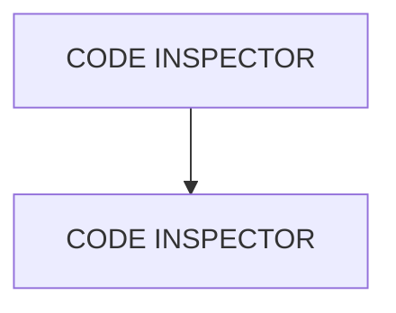

# 🌸 CODE INSPECTOR

## 🌺 OBJECTIFS

- [ ] Accéder et exécuter le `Code Inspector`
- [ ] Localiser l'origine de l'erreur

## 🌺 VUE D'ENSEMBLE

## 🌺 CODE INSPECTOR

### 🍧 DÉFINITION

> [!IMPORTANT]
> Le Code Inspector
>
> - contrôle la qualité global
> - vérifie les règles plus larges et plus strictes
> - est souvent exigé avant transport

### 🍧 NAVIGATION

> [!IMPORTANT]
> Le `Code Inspector` est accessible de la même manière qu'Extended Check. Il se lancera directement.

> [!IMPORTANT]
> Si une erreur est détectée, vous pourrez alors développer la hiérarchie à gauche jusqu'à atteindre le problème. En double-cliquant sur ce dernier, vous pourrez accéder au code problématique de la même manière qu'avec l'`Extended Check`.

## 🌺 RÉSUMÉ

> - Savoir utiliser **code inspector** dans le contexte présenté.

🍧 Afficher l’auto-évaluation

- [ ] Je peux définir **CODE INSPECTOR** avec mes propres mots.
- [ ] Je peux expliquer **code inspector** sans relire le chapitre.
- [ ] Je peux appliquer ou illustrer **un exemple concret** dans un exemple simple.
- [ ] Je peux identifier au moins une erreur fréquente ou une limite liée à cette notion.

