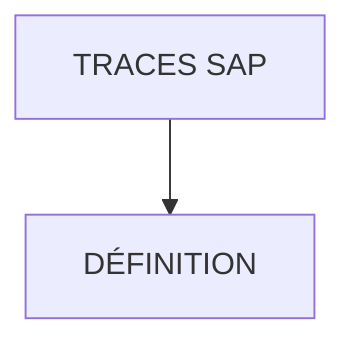

# 🌸 TRACES SAP

## 🌺 OBJECTIFS

- [ ] Comprendre ce qu’est une `trace SAP`
- [ ] Savoir lancer une `trace` simple sans risque
- [ ] Savoir utiliser une `trace` pour justifier un test
- [ ] Savoir documenter un test avec captures écran

## 🌺 VUE D'ENSEMBLE

## 🌺 DÉFINITION

> [!IMPORTANT]
>
> - Une `trace` permet d’observer ce que fait réellement le `système`
> - Elle ne teste pas le code
> - Elle prouve qu’une action ou un comportement a eu lieu
> - Elle sert de support de preuve dans un fichier de tests

Dans ce cadre :

> [!NOTE]
>
> - Le développeur écrit le test unitaire
> - Le consultant exécute, observe, documente

## 🌺 RÉSUMÉ

> - Savoir utiliser **définition** dans le contexte présenté.

🍧 Afficher l’auto-évaluation

- [ ] Je peux définir **TRACES SAP** avec mes propres mots.
- [ ] Je peux expliquer **définition** sans relire le chapitre.
- [ ] Je peux appliquer ou illustrer **un exemple concret** dans un exemple simple.
- [ ] Je peux identifier au moins une erreur fréquente ou une limite liée à cette notion.

