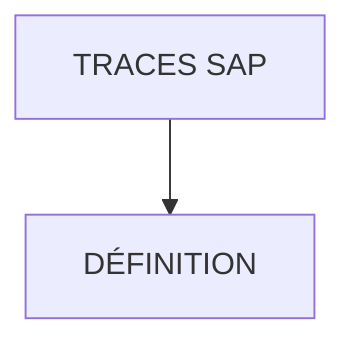

# 🌸 TRACES SAP

## 🌺 OBJECTIFS

- [ ] Comprendre ce qu’est une `trace SAP`
- [ ] Savoir lancer une `trace` simple sans risque
- [ ] Savoir utiliser une `trace` pour justifier un test
- [ ] Savoir documenter un test avec captures écran

## 🌺 VUE D'ENSEMBLE



## 🌺 DÉFINITION

> [!IMPORTANT]
>
> - Une `trace` enregistre des événements produits pendant une exécution.
> - Elle complète un test en montrant les appels réellement exécutés, leur durée ou leurs accès aux ressources.
> - Elle ne prouve pas, seule, que le résultat métier est correct : le résultat attendu doit être vérifié séparément.
> - Elle sert de preuve technique seulement si le périmètre, l'utilisateur, l'heure, l'action et l'interprétation sont documentés.

Dans ce cadre :

> [!NOTE]
>
> - Le développeur écrit et exécute les tests automatisés.
> - Le consultant technique peut déclencher une trace, reproduire le scénario, analyser les mesures et documenter la conclusion.

## 🌺 CHOISIR LA TRACE

| Besoin | Outil | Ce qu'il mesure |
| --- | --- | --- |
| Analyser les accès SQL | `ST05` | Requêtes SQL, durée, lignes accédées et origine ABAP |
| Localiser du temps ABAP | `SAT` | Temps d'exécution et hiérarchie des appels |
| Combiner analyse ABAP et SQL | `ST12`, si installé | Traces ABAP et performance dans un même scénario |

Une trace SQL ne remplace pas une trace ABAP. Choisir l'outil à partir de l'hypothèse à vérifier.

## 🌺 PROCÉDURE MINIMALE

1. Définir une action unique et un résultat attendu.
2. Exécuter une première fois le scénario pour charger les buffers.
3. Activer la trace pour son propre utilisateur et le périmètre le plus étroit possible.
4. Exécuter une seule fois l'action mesurée.
5. Désactiver immédiatement la trace.
6. Filtrer les résultats sur l'utilisateur, le programme et l'intervalle de temps.
7. Identifier les événements coûteux ou inattendus ; ne pas conclure à partir d'une seule durée sans répétition comparable.
8. Documenter outil, système, utilisateur, date, scénario, filtres, résultat observé et conclusion.

> [!WARNING]
> Une trace consomme des ressources et peut contenir des données techniques sensibles. Ne pas lancer une trace large ou visant un autre utilisateur sans autorisation. Toujours l'arrêter après la reproduction.

## 🌺 EXEMPLE DE PREUVE

```text
Outil       : ST05 — SQL Trace
Scénario    : afficher la liste des commandes pour un client
Périmètre   : utilisateur FORMATION01, une exécution
Observation : 3 instructions SQL ; aucune erreur SQL
Conclusion  : les accès observés correspondent au scénario ; la conformité du résultat métier est vérifiée séparément
```

## 🌺 SOURCE

SAP SE, *Analyzing Performance with the ABAP Runtime Analysis*, SAP Gateway Foundation 2025 FPS01, février 2026 : https://help.sap.com/docs/ABAP_PLATFORM_NEW/ba879a6e2ea04d9bb94c7ccd7cdac446/3c74c6163ce4459888bc06dedda37685.html

## 🌺 RÉSUMÉ

> - Une trace répond à une hypothèse précise, sur un périmètre limité, puis doit être arrêtée et interprétée.
> - `ST05` cible notamment SQL ; `SAT` cible le temps d'exécution ABAP ; `ST12` combine les deux lorsqu'il est disponible.

<details>
<summary>🍧 Afficher l’auto-évaluation</summary>

- [ ] Je peux définir **TRACES SAP** avec mes propres mots.
- [ ] Je peux expliquer **définition** sans relire le chapitre.
- [ ] Je peux appliquer ou illustrer **un exemple concret** dans un exemple simple.
- [ ] Je peux identifier au moins une erreur fréquente ou une limite liée à cette notion.

</details>
