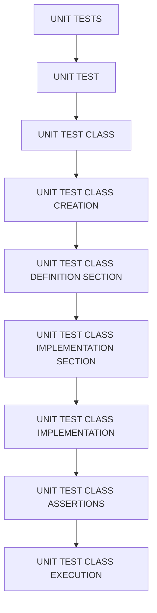

# 🌸 SOMMAIRE — UNIT TESTS

## 🌺 OBJECTIFS DU COURS

- [ ] Comprendre la progression générale du cours.
- [ ] Identifier l’ordre conseillé des chapitres.
- [ ] Retrouver rapidement une notion précise.

## 🌺 PARCOURS

> [!IMPORTANT]
> Suivre les chapitres dans l’ordre numérique, sauf révision ciblée d’une notion déjà étudiée.

## 🌺 CHAPITRES

- [UNIT TEST](<./01 - 🍧 UNIT TEST.md>)
- [UNIT TEST CLASS](<./02 - 🍧 UNIT TEST CLASS.md>)
- [UNIT TEST CLASS CREATION](<./03 - 🍧 UNIT TEST CLASS CREATION.md>)
- [UNIT TEST CLASS DEFINITION SECTION](<./04 - 🍧 UNIT TEST CLASS DEFINITION SECTION.md>)
- [UNIT TEST CLASS IMPLEMENTATION SECTION](<./05 - 🍧 UNIT TEST CLASS IMPLEMENTATION SECTION.md>)
- [UNIT TEST CLASS IMPLEMENTATION](<./06 - 🍧 UNIT TEST CLASS IMPLEMENTATION.md>)
- [UNIT TEST CLASS ASSERTIONS](<./07 - 🍧 UNIT TEST CLASS ASSERTIONS.md>)
- [UNIT TEST CLASS EXECUTION](<./08 - 🍧 UNIT TEST CLASS EXECUTION.md>)

Afficher la méthode de travail

1. Lire les objectifs du chapitre.
2. Étudier le schéma Mermaid.
3. Reproduire les exemples.
4. Réaliser l’exercice sans consulter la correction.
5. Valider l’auto-évaluation.

## 🌺 RÉSUMÉ

> - Ce sommaire représente le parcours du cours **UNIT TESTS**.
> - Les liens pointent vers les chapitres conservés dans leur emplacement d’origine.
