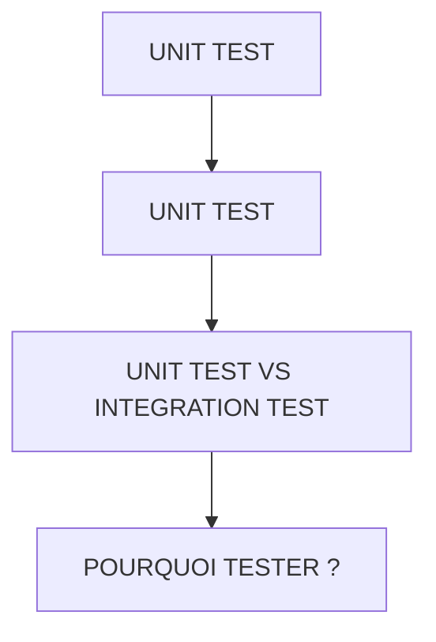

# 🌸 UNIT TEST

## 🌺 OBJECTIFS

- [ ] Comprendre ce qu’est un `Unit Test`
- [ ] Différencier `Unit Test` et test d’intégration
- [ ] Comprendre pourquoi les tests sont essentiels pour la qualité du code

## 🌺 VUE D'ENSEMBLE

## 🌺 UNIT TEST

- Un `Unit Test` teste une seule unité de code : une méthode ou une fonction.
- Il vérifie que la fonction renvoie le résultat attendu pour un cas donné.
- Exemple simple : méthode qui calcule la TVA → test pour vérifier que `TVA(100) = 20`.

## 🌺 UNIT TEST VS INTEGRATION TEST

| 🍧 Critère  | 🍧 Unit Test                    | 🍧 Test d’intégration                       |
| ----------- | ------------------------------- | ------------------------------------------- |
| Cible       | Méthode / fonction seule        | Ensemble de modules / composants            |
| Dépendances | Minimales, isolées              | Dépendances système / base / autres modules |
| Vitesse     | Très rapide                     | Plus lent                                   |
| Objectif    | Vérifier la logique d’une unité | Vérifier l’interaction entre unités         |

> [!CAUTION]
> Les tests unitaires doivent être simples, rapides et indépendants.

## 🌺 POURQUOI TESTER ?

> [!IMPORTANT]
>
> - Détecter les erreurs tôt dans le développement
> - Garantir que les modifications futures ne cassent pas le code existant
> - Documenter le comportement attendu du code
> - Faciliter la maintenance et la compréhension du code

## 🌺 RÉSUMÉ

> - Savoir utiliser **unit test** dans le contexte présenté.
> - Savoir utiliser **unit test vs integration test** dans le contexte présenté.
> - Savoir utiliser **pourquoi tester ?** dans le contexte présenté.

🍧 Afficher l’auto-évaluation

- [ ] Je peux définir **UNIT TEST** avec mes propres mots.
- [ ] Je peux expliquer **unit test** sans relire le chapitre.
- [ ] Je peux appliquer ou illustrer **unit test vs integration test** dans un exemple simple.
- [ ] Je peux identifier au moins une erreur fréquente ou une limite liée à cette notion.

