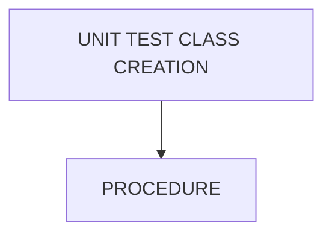

# 🌸 UNIT TEST CLASS CREATION

## 🌺 OBJECTIFS

- [ ] Expliquer le rôle de **UNIT TEST CLASS CREATION** dans le contexte présenté.
- [ ] Comprendre **procedure**.
- [ ] Appliquer la notion dans un exemple simple.
- [ ] Reconnaître les erreurs fréquentes et les limites de l’approche.

## 🌺 VUE D'ENSEMBLE



## 🌺 PROCEDURE

> [!NOTE]
> Une méthode doit au moins exister dans la class à tester.
> Pour la démo, nous allons créé la classe `ZCL_CUSTOMER_ORDERS` en `SE24`.

```abap
CLASS zcl_customer_orders DEFINITION
  PUBLIC
  FINAL
  CREATE PUBLIC .

  PUBLIC SECTION.
    METHODS: get_order_count
      IMPORTING iv_customer     TYPE kunnr
      RETURNING VALUE(rv_count) TYPE i.
  PROTECTED SECTION.
  PRIVATE SECTION.
ENDCLASS.

CLASS zcl_customer_orders IMPLEMENTATION.

  METHOD get_order_count.
    SELECT COUNT(*) FROM vbak
      INTO rv_count
      WHERE kunnr = iv_customer.
  ENDMETHOD.

ENDCLASS.
```

### 🍧 ABAP UNIT TEST CLASS CRÉATION


> [!CAUTION]
> Nommer la classe de test :
>
> - Classe : convention `ltc_<nom_classe>` (ltc = local test class)


> [!IMPORTANT]
> La `Unit Test Class` est accessible depuis l'interface `SE24` via le bouton 'Classes de test locales'.


## 🌺 RÉSUMÉ

> - Savoir utiliser **procedure** dans le contexte présenté.

<details>
<summary>🍧 Afficher l’auto-évaluation</summary>

- [ ] Je peux définir **UNIT TEST CLASS CREATION** avec mes propres mots.
- [ ] Je peux expliquer **procedure** sans relire le chapitre.
- [ ] Je peux appliquer ou illustrer **un exemple concret** dans un exemple simple.
- [ ] Je peux identifier au moins une erreur fréquente ou une limite liée à cette notion.

</details>
