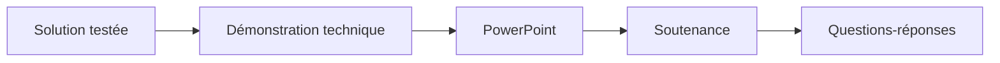

# 🌸 SOMMAIRE — LIVRAISON ET SOUTENANCE

## 🌺 OBJECTIFS

- [ ] Préparer une démonstration technique reproductible.
- [ ] Construire un PowerPoint synthétique.
- [ ] Répartir une présentation collective.
- [ ] Préparer les questions techniques individuelles.

## 🌺 PARCOURS

## 🌺 CHAPITRES

- [PRÉPARATION D'UNE DÉMONSTRATION TECHNIQUE](<./01 - 🍧 DEMONSTRATION TECHNIQUE.md>)
- [POWERPOINT ET SOUTENANCE TECHNIQUE](<./02 - 🍧 POWERPOINT ET SOUTENANCE.md>)

## 🌺 RÉSUMÉ

> La restitution démontre une solution déjà testée. Elle ne remplace ni la campagne de tests ni la maîtrise individuelle du code.
