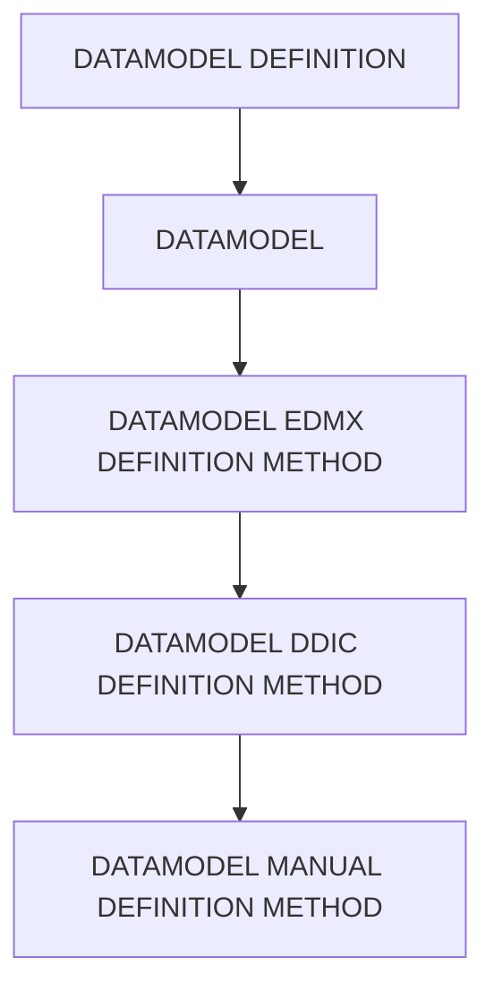

# 🌸 SOMMAIRE — DATAMODEL DEFINITION

## 🌺 OBJECTIFS DU COURS

- [ ] Comprendre la progression générale du cours.
- [ ] Identifier l’ordre conseillé des chapitres.
- [ ] Retrouver rapidement une notion précise.

## 🌺 PARCOURS

> [!IMPORTANT]
> Suivre les chapitres dans l’ordre numérique, sauf révision ciblée d’une notion déjà étudiée.

## 🌺 CHAPITRES

- [DATAMODEL](<./01 - 🍧 DATAMODEL.md>)
- [DATAMODEL EDMX DEFINITION METHOD](<./02 - 🍧 DATAMODEL EDMX DEFINITION METHOD.md>)
- [DATAMODEL DDIC DEFINITION METHOD](<./03 - 🍧 DATAMODEL DDIC DEFINITION METHOD.md>)
- [DATAMODEL MANUAL DEFINITION METHOD](<./04 - 🍧 DATAMODEL MANUAL DEFINITION METHOD.md>)

Afficher la méthode de travail

1. Lire les objectifs du chapitre.
2. Étudier le schéma Mermaid.
3. Reproduire les exemples.
4. Réaliser l’exercice sans consulter la correction.
5. Valider l’auto-évaluation.

## 🌺 RÉSUMÉ

> - Ce sommaire représente le parcours du cours **DATAMODEL DEFINITION**.
> - Les liens pointent vers les chapitres conservés dans leur emplacement d’origine.
