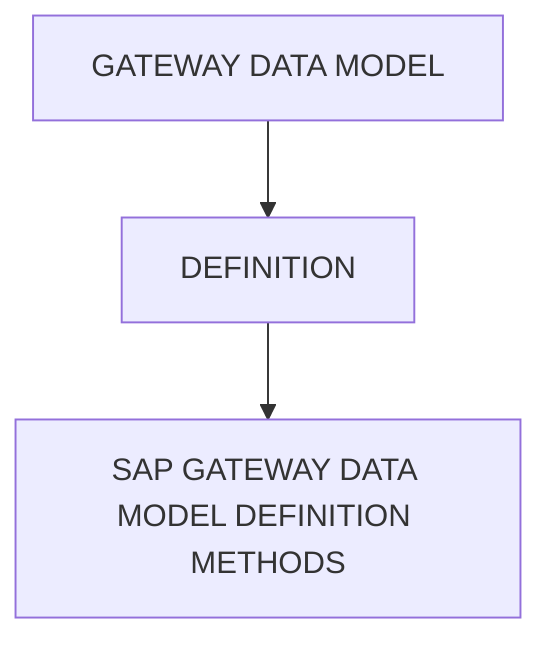

# 🌸 GATEWAY DATA MODEL

## 🌺 VUE D'ENSEMBLE

## 🌺 OBJECTIFS

- [ ] Définir un `Data Model`
- [ ] Identifier les méthodes de `Data Model Definition`

## 🌺 DÉFINITION

> [!IMPORTANT]
> Le `Data Model` est la description structurée des données exposées par un `OData Service` :
> il définit quelles données existent, comment elles sont organisées, et comment elles sont liées entre elles.
> Le `Data Model` répond aux questions :
> - Quelles sont les `Entities` ? (ex : BusinessPartner, Order, Product…)
> - Quelles propriétés possède chaque `Entity` ? (ex : Name, Status, Quantity…)
> - Comment ces `Entities` sont liées entre elles ? (ex : un Order → plusieurs Items)
> - Quels formats et types utilisent ces données ? (String, Date, Boolean, Int…)

## 🌺 SAP GATEWAY DATA MODEL DÉFINITION METHODS

> [!TIP]
> Une fois votre `Project` créé dans le `SAP Gateway Service Builder`, vous pouvez démarrer le `Data Modeling process`. Selon vos besoins, vous pouvez définir un `Data Model` de plusieurs manières :

> [!CAUTION]
> Toutes les actions effectuées dans la branche Data Model du `Project` génèrent du code ABAP dans la `MPC - Model Provider Class` (classe du fournisseur de modèle).

### 🍧 IMPORT DATA MODEL (EDMX) METHOD

Vous pouvez réutiliser un `Data Model` existant en important un fichier `XML` au format `EDMX` (`Entity Data Model Extension`). Ce fichier peut être créé par des éditeurs de modèles externes comme `Microsoft Visual Studio` ou vous pouvez télécharger les `$metadata` d’un `OData Service` existant.

### 🍧 IMPORT DDIC STRUCTURE METHOD

Vous pouvez importer une `DatabaseView`, une `Transparent Table`, ou tout autre type de `Structure` depuis l'`ABAP Data Dictionary (DDIC)` pour créer facilement un nouvel `Entity` (`PrimitiveType` (simple) ou `ComplexType` (`deep structure`)).

Vous pouvez importer les types de `Structures` suivants dans le `Project` SAP Gateway :

- Structures
- Transparent tables
- Views

### 🍧 DEFINE DATA MODEL DECLARATIVELY METHOD

Vous pouvez définir manuellement un nouveau `Data Model` au sein de votre `Project/service`, c’est-à-dire créer de zéro les éléments individuels du modèle, tels que les `EntityTypes`, les `EntitySets` et les `Associations`. C'est la méthode la plus longue et la moins recommandée.

## 🌺 RÉSUMÉ

> - Savoir utiliser **définition** dans le contexte présenté.
> - **Sap gateway data model définition methods :** Vous pouvez réutiliser un Data Model existant en important un fichier XML au format EDMX (Entity Data Model Extension).

🍧 Afficher l’auto-évaluation

- [ ] Je peux définir **GATEWAY DATA MODEL** avec mes propres mots.
- [ ] Je peux expliquer **objectives** sans relire le chapitre.
- [ ] Je peux appliquer ou illustrer **definition** dans un exemple simple.
- [ ] Je peux identifier au moins une erreur fréquente ou une limite liée à cette notion.

