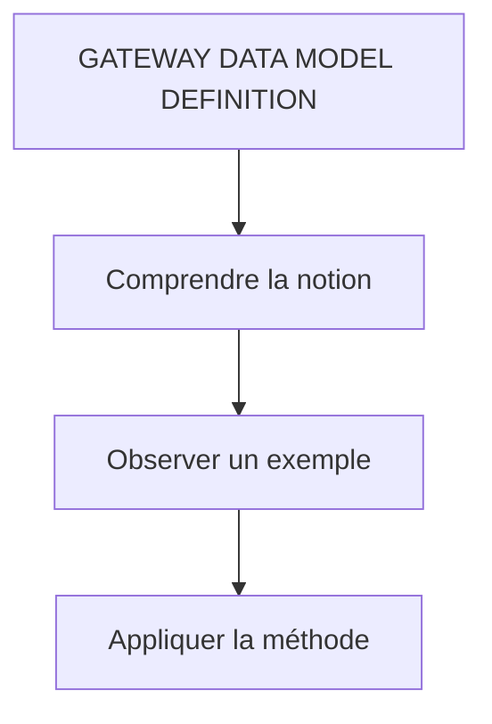

# 🌸 GATEWAY DATA MODEL DEFINITION

## 🌺 VUE D'ENSEMBLE

## 🌺 OBJECTIFS

- [ ] `Import DataModel (EDMX) Method` pour définir un `DataModel`

### 🍧 IMPORT DATAMODEL (EDMX) METHOD

> [!IMPORTANT]
> Pour la démo, le `$Metadata` [ZBC_GATEWAYSRVDEMO_SRV.xml](../assets/ZBC_GATEWAYSRVDEMO_SRV.xml) servira d'exemple pour importer les Data Models dans le `Gateway Project` `ZTRI_GATEWAY_DEMO`. Télécharger le en conséquence.

> [!NOTE]
> Rechercher, ouvrer et passer en modification sur le `Gateway Project` `ZTRI_GATEWAY_DEMO`

> [!NOTE]
> Effectuer un Right-Clic sur `Data Model` → `Import` → `Data Model from File`

> [!NOTE]
> Cliquer sur `Browse` et rechercher le fichier `$Metadata` [ZBC_GATEWAYSRVDEMO_SRV.xml](../assets/ZBC_GATEWAYSRVDEMO_SRV.xml) sur votre poste de travail.

> [!TIP]
> Il est également possible de renommer les propriétés d'un `EntityType`, car les valeurs proposées sont générées à partir des noms de champs `ABAP` : les tirets bas (underscores) sont supprimés et les segments sont fusionnés en notation `camelCase`.

## 🌺 RÉSUMÉ

> - **GATEWAY DATA MODEL DEFINITION :** connaître le rôle, la syntaxe, les limites et un cas d’utilisation.

🍧 Afficher l’auto-évaluation

- [ ] Je peux définir **GATEWAY DATA MODEL DEFINITION** avec mes propres mots.
- [ ] Je peux expliquer **objectives** sans relire le chapitre.
- [ ] Je peux appliquer ou illustrer **un exemple concret** dans un exemple simple.
- [ ] Je peux identifier au moins une erreur fréquente ou une limite liée à cette notion.

