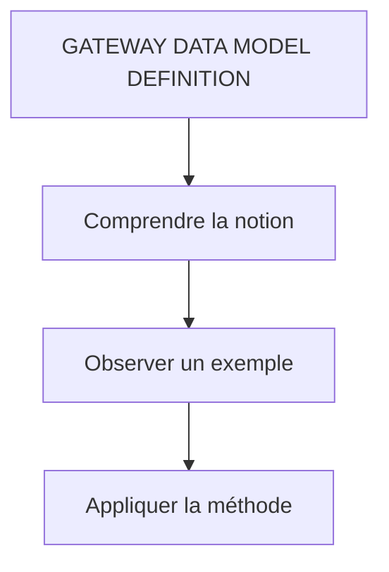

# 🌸 GATEWAY DATA MODEL DEFINITION

## 🌺 VUE D'ENSEMBLE

## 🌺 OBJECTIFS

- [ ] `Import DDIC Structure Method` pour définir un `DataModel`

> [!WARNING]
> Dans le cadre de la démo et si vous avez importer le `$Metadata` [ZBC_GATEWAYSRVDEMO_SRV.xml](../assets/ZBC_GATEWAYSRVDEMO_SRV.xml) dans l'étape précédente, veuiller supprimer les deux `EntityTypes` et `EntitySets` comme suivant.
>
> - Effectuer un Right-Clic sur Chaque `EntityTypes` et `EntitySets` du projet → `Delete`

> [!NOTE]
> Vous devriez avoir ceci :

### 🍧 IMPORT DDIC STRUCTURE METHOD

> [!NOTE]
> Effectuer un Right-Clic sur `Data Model` → `Import` → `DDIC Structure`

> [!CAUTION]
>
> - Nom (de l'`EntityType`) : `Product`
> - [x] `Entity Type`
> - ABAP Structure (à importer) : `BAPI_EPM_PRODUCT_HEADER`
> - [x] `Create Default Entity Set`

> [!TIP]
> Sélectionner le ou les `champs` dont vous avez besoin. Dans le cadre de la démo, nous allons sélectionner tous les champs de la structure.

> [!CAUTION]
> Comme vu précédemment, chaque `EntityType` doit posséder un clé (au moins). Il sera nécessaire de préciser la ou les clés de l'`Entity`, ici `PRODUCT_ID`.

> [!TIP]
> Il est également possible de renommer les propriétés d'un `EntityType`, car les valeurs proposées sont générées à partir des noms de champs `ABAP` : les tirets bas (underscores) sont supprimés et les segments sont fusionnés en notation `camelCase`.

## 🌺 RÉSUMÉ

> - **GATEWAY DATA MODEL DEFINITION :** connaître le rôle, la syntaxe, les limites et un cas d’utilisation.

🍧 Afficher l’auto-évaluation

- [ ] Je peux définir **GATEWAY DATA MODEL DEFINITION** avec mes propres mots.
- [ ] Je peux expliquer **objectives** sans relire le chapitre.
- [ ] Je peux appliquer ou illustrer **un exemple concret** dans un exemple simple.
- [ ] Je peux identifier au moins une erreur fréquente ou une limite liée à cette notion.

