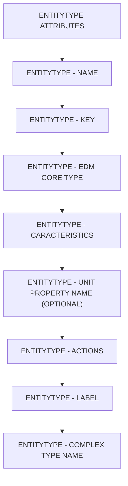

# 🌸 SOMMAIRE — ENTITYTYPE ATTRIBUTES

## 🌺 OBJECTIFS DU COURS

- [ ] Comprendre la progression générale du cours.
- [ ] Identifier l’ordre conseillé des chapitres.
- [ ] Retrouver rapidement une notion précise.

## 🌺 PARCOURS

> [!IMPORTANT]
> Suivre les chapitres dans l’ordre numérique, sauf révision ciblée d’une notion déjà étudiée.

## 🌺 CHAPITRES

- [ENTITYTYPE - NAME](<./01 - 🍧 ENTITYTYPE - NAME.md>)
- [ENTITYTYPE - KEY](<./02 - 🍧 ENTITYTYPE - KEY.md>)
- [ENTITYTYPE - EDM CORE TYPE](<./03 - 🍧 ENTITYTYPE - EDM CORE TYPE.md>)
- [ENTITYTYPE - CARACTERISTICS](<./04 - 🍧 ENTITYTYPE - CARACTERISTICS.md>)
- [ENTITYTYPE - UNIT PROPERTY NAME (OPTIONAL)](<./05 - 🍧 ENTITYTYPE - UNIT PROPERTY NAME (OPTIONAL).md>)
- [ENTITYTYPE - ACTIONS](<./06 - 🍧 ENTITYTYPE - ACTIONS.md>)
- [ENTITYTYPE - LABEL](<./07 - 🍧 ENTITYTYPE - LABEL.md>)
- [ENTITYTYPE - COMPLEX TYPE NAME](<./08 - 🍧 ENTITYTYPE - COMPLEX TYPE NAME.md>)
- [ENTITYTYPE - ABAP FIELD NAME](<./09 - 🍧 ENTITYTYPE - ABAP FIELD NAME.md>)
- [ENTITYTYPE - SEMANTICS (OPTIONAL)](<./10 - 🍧 ENTITYTYPE - SEMANTICS (OPTIONAL).md>)

Afficher la méthode de travail

1. Lire les objectifs du chapitre.
2. Étudier le schéma Mermaid.
3. Reproduire les exemples.
4. Réaliser l’exercice sans consulter la correction.
5. Valider l’auto-évaluation.

## 🌺 RÉSUMÉ

> - Ce sommaire représente le parcours du cours **ENTITYTYPE ATTRIBUTES**.
> - Les liens pointent vers les chapitres conservés dans leur emplacement d’origine.
