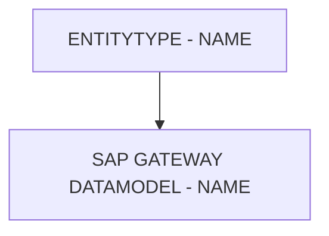

# 🌸 ENTITYTYPE - NAME

## 🌺 OBJECTIFS

- [ ] Expliquer le rôle de **ENTITYTYPE - NAME** dans le contexte présenté.
- [ ] Comprendre **sap gateway datamodel - name**.
- [ ] Appliquer la notion dans un exemple simple.
- [ ] Reconnaître les erreurs fréquentes et les limites de l’approche.
## 🌺 VUE D'ENSEMBLE



> [!IMPORTANT]
> Une modification du modèle OData peut nécessiter une nouvelle génération des artefacts d’exécution et une vérification du document `$metadata` consommé par les clients.


## 🌺 SAP GATEWAY DATAMODEL - NAME

👉 Le champ `Name` est l’identifiant officiel de la `Property` dans tout l'`OData Service` : côté backend, côté `metadata` et côté `Clients`. Il doit être stable, clair et unique.


### 🍧 DÉFINITION

Le champ `Name` est le nom de la `Property` telle qu’elle apparaîtra :

- dans l'`OData Service`,
- dans les données retournées par le `Service`,
- dans la logique `Gateway` (méthodes ABAP générées).

C’est donc l’identifiant unique de cette `Property` au sein de l’`EntityType`.

### 🍧 RÔLE

- Sert de `Key` de référence pour toutes les autres parties du `Service` ;
- Est utilisé par les applications consommatrices pour lire la donnée (`UI5`, `Postman`, `mobile`, `API` ...).

### 🍧 RÈGLES

| 🍧 Règle                                             | 🍧 Explication                                                              |
| ---------------------------------------------------- | --------------------------------------------------------------------------- |
| Unique dans l’EntityType                             | On ne peut pas avoir deux properties avec le même Name dans la même entité. |
| Pas d’espaces                                        | On utilise du PascalCase ou camelCase (SAP utilise PascalCase).             |
| Ne doit pas commencer par un chiffre                 | Standard XML/EDM.                                                           |
| Stable dans le temps                                 | Changer le Name casse toutes les Clients.                                   |
| Correspond souvent (mais pas toujours) au champ DDIC | Surtout dans les Services générés depuis SEGW.                              |

### 🍧 $METADATA EXAMPLES

```xml
<Property Name="Aufnr" Type="Edm.String" Nullable="false" MaxLength="12" />
<Property Name="Status" Type="Edm.String" Nullable="false" MaxLength="4" />
```

- `Aufnr` : Nom de la `Property` → côté `Client`, on recevra "Aufnr": "300012345678" par exemple.
- `Status` : Nom de la `Property` → "Status": "REL" par exemple.

### 🍧 ERREURS

| 🍧 Erreur                                   | 🍧 Pourquoi c’est un problème                            |
| ------------------------------------------- | -------------------------------------------------------- |
| Nom différent du DDIC sans raison           | Confusion pour les développeurs ABAP/Front               |
| Nom trop générique ("Value", "Code")        | Illisible pour les consommateurs du Service              |
| Changer un Name après livraison             | Potentiellement catastrophique : toutes les apps cassent |
| Mettre des caractères spéciaux (é, è, -, /) | Non conforme EDM, risque d’erreurs XML                   |

## 🌺 RÉSUMÉ

> - **Sap gateway datamodel - name :** 👉 Le champ Name est l’identifiant officiel de la Property dans tout l'OData Service : côté backend, côté metadata et côté Clients.

<details>
<summary>🍧 Afficher l’auto-évaluation</summary>

- [ ] Je peux définir **ENTITYTYPE - NAME** avec mes propres mots.
- [ ] Je peux expliquer **sap gateway datamodel - name** sans relire le chapitre.
- [ ] Je peux appliquer ou illustrer **un exemple concret** dans un exemple simple.
- [ ] Je peux identifier au moins une erreur fréquente ou une limite liée à cette notion.

</details>
