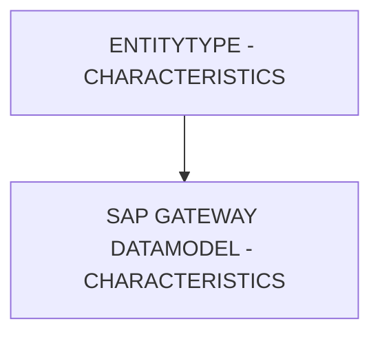

# 🌸 ENTITYTYPE - CHARACTERISTICS

## 🌺 OBJECTIFS

- [ ] Expliquer le rôle de **ENTITYTYPE - CHARACTERISTICS** dans le contexte présenté.
- [ ] Comprendre **sap gateway datamodel - characteristics**.
- [ ] Appliquer la notion dans un exemple simple.
- [ ] Reconnaître les erreurs fréquentes et les limites de l’approche.

## 🌺 VUE D'ENSEMBLE



## 🌺 SAP GATEWAY DATAMODEL - CHARACTERISTICS

Les `Characteristics` définit les `Parameters` numériques d’une `Property` dans un `EntityType` :

- `précision`
- `nombre de décimales`
- `valeur maximale`

Ces informations contrôlent le stockage, la validation et le formatage côté `Front-end` et `Back-end`.

### 🍧 DÉFINITION

- `Precision` : nombre total de chiffres que la `Property` peut contenir.
- `Scale` : nombre de chiffres après la virgule pour les nombres décimaux.
- `Maximum` : valeur maximale autorisée pour la `Property`.

Ces valeurs sont enregistrées dans le `$metadata` pour garantir cohérence et validation automatique des données dans `SAP` et `OData`.

### 🍧 RÔLE

- Assurer que les valeurs stockées respectent la `précision` et les limites définies.
- Permettre au `Front-end` (UI5/Fiori) d’appliquer un formatage correct.
- Garantir la compatibilité avec les champs `DDIC` et les types `EDM`.

### 🍧 RÈGLES

> [!TIP]
> Afin d'éviter de rechercher les valeurs exactes des caractéristiques à définir, il est toujours préférables d'`Import` les information avec la `DDIC Structure Method` pour définir un `DataModel`.

| 🍧 Règle               | 🍧 Explication                                                      |
| ---------------------- | ------------------------------------------------------------------- |
| Precision cohérente    | Ne pas dépasser la taille du champ DDIC correspondant               |
| Scale compatible       | Les décimales doivent correspondre aux besoins métiers              |
| Maximum défini         | Empêche la saisie de valeurs supérieures à ce qui est autorisé      |
| Stable après livraison | Modifier casse la validation automatique côté applications clientes |

### 🍧 $METADATA EXAMPLES

```xml
<Property Name="NetValue" Type="Edm.Decimal" Nullable="false" Precision="13" Scale="2" />
<Property Name="Quantity" Type="Edm.Decimal" Nullable="false" Precision="10" Scale="3" Maximum="10000" />
```

- `NetValue` : nombre décimal avec 13 chiffres maximum et 2 décimales.
- `Quantity` : nombre décimal avec 10 chiffres maximum, 3 décimales et valeur maximale 10000.

### 🍧 ERREURS

| 🍧 Erreur                       | 🍧 Pourquoi c’est un problème                              |
| ------------------------------- | ---------------------------------------------------------- |
| Precision trop faible           | Valeurs tronquées ou erreur lors de l’insertion            |
| Scale incorrect                 | Arrondi non désiré, perte de précision                     |
| Maximum absent quand nécessaire | Saisie possible de valeurs interdites                      |
| Changement après livraison      | Applications clientes et services OData risquent de casser |

## 🌺 RÉSUMÉ

> - **Sap gateway datamodel - characteristics :** Les Characteristics définit les Parameters numériques d’une Property dans un EntityType :

<details>
<summary>🍧 Afficher l’auto-évaluation</summary>

- [ ] Je peux définir **ENTITYTYPE - CHARACTERISTICS** avec mes propres mots.
- [ ] Je peux expliquer **sap gateway datamodel - characteristics** sans relire le chapitre.
- [ ] Je peux appliquer ou illustrer **un exemple concret** dans un exemple simple.
- [ ] Je peux identifier au moins une erreur fréquente ou une limite liée à cette notion.

</details>
