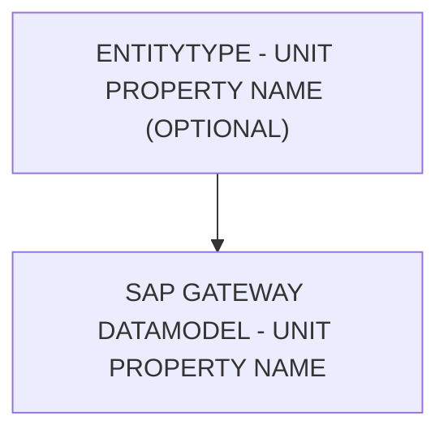

# 🌸 ENTITYTYPE - UNIT PROPERTY NAME (OPTIONAL)

## 🌺 OBJECTIFS

- [ ] Expliquer le rôle de **ENTITYTYPE - UNIT PROPERTY NAME (OPTIONAL)** dans le contexte présenté.
- [ ] Comprendre **sap gateway datamodel - unit property name**.
- [ ] Appliquer la notion dans un exemple simple.
- [ ] Reconnaître les erreurs fréquentes et les limites de l’approche.
## 🌺 VUE D'ENSEMBLE

## 🌺 SAP GATEWAY DATAMODEL - UNIT PROPERTY NAME

La colonne `Unit Property Name` permet de lier une `Property` numérique (Amount ou Quantity) à sa `Property` d’unité correspondante dans le même `EntityType`. Elle sert uniquement à la documentation et au mapping automatique dans certains cas, mais est complètement facultative.

### 🍧 DÉFINITION

- Champ `SEGW` qui référence une autre `Property` de l’`EntityType` représentant l’unité de mesure.
- Utilisé pour indiquer quelle `Property` contient l’unité associée à une valeur numérique.
- Sert aux générateurs et outils SAP pour formater ou interpréter correctement les valeurs côté `Front-end`.

### 🍧 RÔLE

- Facilite la lecture des données par les applications consommatrices (`UI5`/`Fiori`, `analytics`).
- Permet aux `Frameworks` de relier automatiquement la valeur et son unité pour l’affichage ou le calcul.
- Sert de guide pour la génération de code et le `$metadata OData`, mais n’est pas strictement requis.

### 🍧 OPTIONAL

- Toutes les `Properties` numériques n’ont pas d’unité associée (ex. identifiants, codes, flags).
- `SAP` peut gérer les valeurs numériques sans unité pour les affichages simples ou calculs internes.
- L’absence de cette liaison ne bloque pas la génération du service ni l’accès aux données.

> [!TIP]
> Il est plus courant de récupérer l'unité de mesure en tant que champ séparé en `edm.string`, `Unit Property Name` est quasiment jamais utilisé (même à défaut en important les valeurs depuis le `DDIC`).

### 🍧 RÈGLES

| 🍧 Règle                                   | 🍧 Explication                                                                      |
| ------------------------------------------ | ----------------------------------------------------------------------------------- |
| Ne référencer que des Properties existantes | La Property d’unité doit être définie dans le même EntityType                       |
| Compatible avec le type numérique          | Seules les Properties de type Quantity ou Amount peuvent avoir un Unit Property Name |
| Optionnelle                                | Peut rester vide si la valeur n’a pas d’unité spécifique                            |
| Stable dans le temps                       | Changer après livraison peut casser les comportements automatiques côté UI5/Fiori   |

### 🍧 ERREURS

| 🍧 Erreur                                       | 🍧 Pourquoi c’est un problème                                 |
| ----------------------------------------------- | ------------------------------------------------------------- |
| Unit Property Name incorrect                    | Liens brisés, UI5/Fiori ne sait pas quelle unité afficher     |
| Référence vers une Property non numérique       | Incompatible, erreur côté metadata ou générateur              |
| Changement après livraison                      | Applications clientes peuvent afficher des valeurs sans unité |
| Définir pour une Property qui n’en a pas besoin | Complexité inutile et confusion dans le metadata              |

## 🌺 RÉSUMÉ

> - **Sap gateway datamodel - unit property name :** La colonne Unit Property Name permet de lier une Property numérique (Amount ou Quantity) à sa Property d’unité correspondante dans le même EntityType.

🍧 Afficher l’auto-évaluation

- [ ] Je peux définir **ENTITYTYPE - UNIT PROPERTY NAME (OPTIONAL)** avec mes propres mots.
- [ ] Je peux expliquer **sap gateway datamodel - unit property name** sans relire le chapitre.
- [ ] Je peux appliquer ou illustrer **un exemple concret** dans un exemple simple.
- [ ] Je peux identifier au moins une erreur fréquente ou une limite liée à cette notion.

