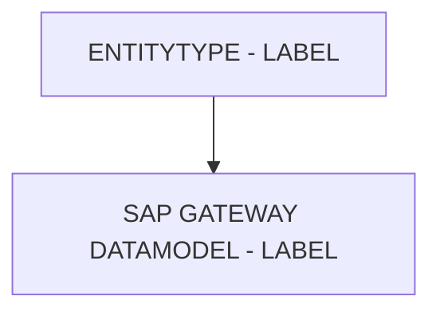

# 🌸 ENTITYTYPE - LABEL

## 🌺 OBJECTIFS

- [ ] Expliquer le rôle de **ENTITYTYPE - LABEL** dans le contexte présenté.
- [ ] Comprendre **sap gateway datamodel - label**.
- [ ] Appliquer la notion dans un exemple simple.
- [ ] Reconnaître les erreurs fréquentes et les limites de l’approche.
## 🌺 VUE D'ENSEMBLE



> [!IMPORTANT]
> Une modification du modèle OData peut nécessiter une nouvelle génération des artefacts d’exécution et une vérification du document `$metadata` consommé par les clients.


## 🌺 SAP GATEWAY DATAMODEL - LABEL

Le `Label` définit le nom lisible et affichable d’une `Property` dans un `EntityType`. Contrairement au `Name`, il n’affecte pas le `OData Service` ou le `Nack-end`, mais sert uniquement à l’affichage côté `Front-end` et à la `Documentation`.

### 🍧 DÉFINITION

- Texte court représentant la `Property` pour les `Final Users`.
- Peut contenir des espaces, accents ou caractères spéciaux.
- Stocké dans le `$metadata` pour être utilisé par `UI5`/`Fiori`, `Fiori Elements` et autres outils `SAP`.

### 🍧 RÔLE

- Affichage dans les formulaires, tables et rapports `UI5`/`Fiori`.
- Facilite la compréhension pour les `Final Users` et les équipes métier.
- Sert à générer automatiquement les titres de colonnes et les `input labels` dans les applications.

### 🍧 RÈGLES

| 🍧 Règle                      | 🍧 Explication                                                |
| ----------------------------- | ------------------------------------------------------------- |
| Doit être clair et précis     | Permet aux Final Users de comprendre la donnée                |
| Langue cohérente              | Respecter la langue de l’application (ex. FR pour FR SAP UI5) |
| Stable dans le temps          | Changer casse la cohérence des écrans ou rapports             |
| Caractères spéciaux autorisés | Contrairement au Name, on peut utiliser espaces et accents    |
| Correspondre à la `Property`  | Ne pas confondre plusieurs `Property`s avec le même Label     |

### 🍧 $METADATA EXAMPLES

```xml
<Property Name="Aufnr" Type="Edm.String" Nullable="false" sap:label="Numéro d’ordre" />
<Property Name="Status" Type="Edm.String" Nullable="true" sap:label="Statut" />
```

- `Aufnr` : affiché dans UI5/Fiori comme "Numéro d’ordre"
- `Status` : affiché comme "Statut"

### 🍧 ERREURS

| 🍧 Erreur                             | 🍧 Pourquoi c’est un problème                                |
| ------------------------------------- | ------------------------------------------------------------ |
| Label générique ou ambigu             | Confusion pour les Final Users                               |
| Changement fréquent                   | Les écrans et rapports peuvent devenir incohérents           |
| Label identique pour plusieurs champs | Difficulté à distinguer les Properties dans l’interface       |
| Langue incohérente                    | UI5/Fiori risque de mélanger les libellés dans l’application |

## 🌺 RÉSUMÉ

> - **Sap gateway datamodel - label :** Le Label définit le nom lisible et affichable d’une Property dans un EntityType.

<details>
<summary>🍧 Afficher l’auto-évaluation</summary>

- [ ] Je peux définir **ENTITYTYPE - LABEL** avec mes propres mots.
- [ ] Je peux expliquer **sap gateway datamodel - label** sans relire le chapitre.
- [ ] Je peux appliquer ou illustrer **un exemple concret** dans un exemple simple.
- [ ] Je peux identifier au moins une erreur fréquente ou une limite liée à cette notion.

</details>
