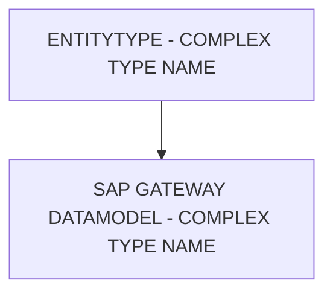

# 🌸 ENTITYTYPE - COMPLEX TYPE NAME

## 🌺 OBJECTIFS

- [ ] Expliquer le rôle de **ENTITYTYPE - COMPLEX TYPE NAME** dans le contexte présenté.
- [ ] Comprendre **sap gateway datamodel - complex type name**.
- [ ] Appliquer la notion dans un exemple simple.
- [ ] Reconnaître les erreurs fréquentes et les limites de l’approche.
## 🌺 VUE D'ENSEMBLE



> [!IMPORTANT]
> Une modification du modèle OData peut nécessiter une nouvelle génération des artefacts d’exécution et une vérification du document `$metadata` consommé par les clients.


## 🌺 SAP GATEWAY DATAMODEL - COMPLEX TYPE NAME

Le `ComplexType Name` définit le `ComplexType` associé à une `Property` lorsqu’elle contient un ensemble structuré de `sub-Properties`. Il ne correspond pas à un `PrimitiveType` (string, decimal, boolean), mais à un type qui regroupe plusieurs `fields` défini dans le `$metadata`.


### 🍧 DÉFINITION

- Nom d’un `ComplexType` référencé dans le `$metadata`.
- Utilisé lorsque la `Property` n’est pas simple mais composée de plusieurs `sub-field` (ex. adresse, coordonnées).
- Permet de réutiliser la même structure dans plusieurs `EntityTypes`.

### 🍧 RÔLE

- Facilite la structuration des données composées.
- Permet aux `Clients` de traiter un ensemble cohérent de `fields` comme une seule `Entity`.
- Réduit la duplication dans le `$metadata` en centralisant la définition des `ComplexType`.

### 🍧 RÈGLES

| 🍧 Règle                                       | 🍧 Explication                                                        |
| ---------------------------------------------- | --------------------------------------------------------------------- |
| Nom unique dans le service                     | Chaque Complex Type doit avoir un identifiant unique dans le metadata |
| Réutilisable                                   | Le même Complex Type peut être utilisé dans plusieurs EntityTypes     |
| Doit contenir uniquement des Properties valides | Sub-Properties doivent respecter les règles EDM et Name                |
| Stable dans le temps                           | Changer casse toutes les Clients qui consomment ce type               |

### 🍧 $METADATA EXAMPLES

```xml
<ComplexType Name="AddressType">
	<Property Name="Street" Type="Edm.String" MaxLength="100" />
	<Property Name="City" Type="Edm.String" MaxLength="40" />
	<Property Name="PostalCode" Type="Edm.String" MaxLength="10" />
	<Property Name="Country" Type="Edm.String" MaxLength="3" />
</ComplexType>

<Property Name="CustomerAddress" Type="Namespace.AddressType" />
```

- `CustomerAddress` : `Property` de l’`EntityType` qui référence le `ComplexType` `AddressType`.
- Permet à `UI5`/`Fiori` de générer un formulaire avec `Street`, `City`, `PostalCode` et `Country` comme `sub-field`.

### 🍧 ERREURS

| 🍧 Erreur                            | 🍧 Pourquoi c’est un problème                      |
| ------------------------------------ | -------------------------------------------------- |
| Nom du Complex Type ambigu           | Risque de conflit et confusion dans le $metadata   |
| Sub-Properties non conformes          | Génération de service ou affichage incorrect       |
| Changement après livraison           | Toutes les Clients qui utilisent ce type cassent   |
| Utilisation pour une Property simple | Inutile, complexité et surcharge dans le $metadata |

## 🌺 RÉSUMÉ

> - **Sap gateway datamodel - complex type name :** Le ComplexType Name définit le ComplexType associé à une Property lorsqu’elle contient un ensemble structuré de sub-Properties.

<details>
<summary>🍧 Afficher l’auto-évaluation</summary>

- [ ] Je peux définir **ENTITYTYPE - COMPLEX TYPE NAME** avec mes propres mots.
- [ ] Je peux expliquer **sap gateway datamodel - complex type name** sans relire le chapitre.
- [ ] Je peux appliquer ou illustrer **un exemple concret** dans un exemple simple.
- [ ] Je peux identifier au moins une erreur fréquente ou une limite liée à cette notion.

</details>
