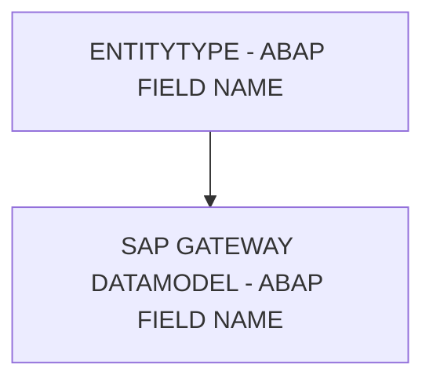

# 🌸 ENTITYTYPE - ABAP FIELD NAME

## 🌺 OBJECTIFS

- [ ] Expliquer le rôle de **ENTITYTYPE - ABAP FIELD NAME** dans le contexte présenté.
- [ ] Comprendre **sap gateway datamodel - abap field name**.
- [ ] Appliquer la notion dans un exemple simple.
- [ ] Reconnaître les erreurs fréquentes et les limites de l’approche.
## 🌺 VUE D'ENSEMBLE



> [!IMPORTANT]
> Une modification du modèle OData peut nécessiter une nouvelle génération des artefacts d’exécution et une vérification du document `$metadata` consommé par les clients.


## 🌺 SAP GATEWAY DATAMODEL - ABAP FIELD NAME

L'`ABAP Field Name` relie une `OData Property` à son `Field` correspondant dans le dictionnaire ABAP (`DDIC`). Il sert de référence technique pour le `Back-end` mais n’affecte pas directement l’affichage côté `Front-end`.


### 🍧 DÉFINITION

- Nom du `DDIC Field` utilisé pour stocker ou récupérer la valeur dans le `ABAP Back-end` .
- Permet au Service généré par SEGW de mapper automatiquement la `Property` OData sur le `Field` ABAP correspondant.
- Facilite la synchronisation entre le modèle OData et la structure DDIC.

### 🍧 RÔLE

- Assurer la cohérence entre les données exposées via OData et celles stockées dans le `Back-end`.
- Permet aux méthodes générées par SEGW (GET_ENTITY, UPDATE_ENTITY, etc.) de fonctionner automatiquement.
- Sert de documentation technique pour les développeurs ABAP et les intégrateurs.

### 🍧 RÈGLES

| 🍧 Règle                                              | 🍧 Explication                                                   |
| ----------------------------------------------------- | ---------------------------------------------------------------- |
| Doit correspondre à un `Field` DDIC existant          | Évite les erreurs de mapping ou d’accès aux données              |
| Respecter la casse et longueur du DDIC                | Les noms incorrects provoquent des échecs de génération          |
| Stable après livraison                                | Changer casse le mapping automatique et peut casser les services |
| Ne pas utiliser pour des calculs ou champs virtuels | Ces champs n’ont pas de correspondance DDIC                    |

### 🍧 $METADATA EXAMPLES

```xml
<Property Name="Aufnr" Type="Edm.String" Nullable="false" MaxLength="12" sap:field="AUFNR" />
<Property Name="Status" Type="Edm.String" Nullable="true" MaxLength="4" sap:field="STAT" />
```

- `Field "Aufnr"` : correspond au `Field DDIC AUFNR`, utilisé pour toutes les opérations `Back-end`.
- `Field "Status"` : correspond au `Field DDIC STAT`.

### 🍧 ERREURS

| 🍧 Erreur                      | 🍧 Pourquoi c’est un problème                          |
| ------------------------------ | ------------------------------------------------------ |
| ABAP Field Name incorrect      | Génération du service échoue ou données non récupérées |
| Field inexistant dans le DDIC  | Service OData ne peut pas mapper la Property           |
| Changement après livraison     | Applications clientes et Back-end risquent de casser   |
| Utiliser pour un Field calculé | Mapping automatique impossible, nécessite code manuel  |

## 🌺 RÉSUMÉ

> - **Sap gateway datamodel - abap field name :** L'ABAP Field Name relie une OData Property à son Field correspondant dans le dictionnaire ABAP (DDIC).

<details>
<summary>🍧 Afficher l’auto-évaluation</summary>

- [ ] Je peux définir **ENTITYTYPE - ABAP FIELD NAME** avec mes propres mots.
- [ ] Je peux expliquer **sap gateway datamodel - abap field name** sans relire le chapitre.
- [ ] Je peux appliquer ou illustrer **un exemple concret** dans un exemple simple.
- [ ] Je peux identifier au moins une erreur fréquente ou une limite liée à cette notion.

</details>
