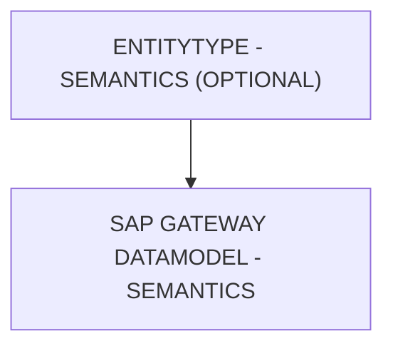

# 🌸 ENTITYTYPE - SEMANTICS (OPTIONAL)

## 🌺 OBJECTIFS

- [ ] Expliquer le rôle de **ENTITYTYPE - SEMANTICS (OPTIONAL)** dans le contexte présenté.
- [ ] Comprendre **sap gateway datamodel - semantics**.
- [ ] Appliquer la notion dans un exemple simple.
- [ ] Reconnaître les erreurs fréquentes et les limites de l’approche.
## 🌺 VUE D'ENSEMBLE

> [!IMPORTANT]
> Une modification du modèle OData peut nécessiter une nouvelle génération des artefacts d’exécution et une vérification du document `$metadata` consommé par les clients.

## 🌺 SAP GATEWAY DATAMODEL - SEMANTICS

La colonne `Semantics` définit le rôle fonctionnel ou le type métier d’une `Property` dans l'`OData Service`. Elle informe les `Frameworks` et applications clientes sur le traitement, l’affichage et la validation adaptés à la donnée.

### 🍧 DÉFINITION

- Indique la signification métier de la `Property` (ex. Amount, Quantity, Indicator, Date, Time).
- Stockée dans le `$metadata` pour permettre aux outils SAP (`UI5`/`Fiori`, `Fiori Elements`, Analyt``ics) de comprendre le type de contenu.
- Ne change pas le type technique `EDM` de la `Property`, mais influence le formatage et le comportement côté `Client`.

### 🍧 RÔLE

- Appliquer automatiquement les formats d’affichage adaptés (ex. décimales pour Amount, case à cocher pour Indicator).
- Faciliter la validation des données selon leur signification métier.
- Aider les générateurs et `frameworks` SAP à interpréter correctement la `Property` dans les formulaires, tables et rapports.

### 🍧 RECOGNIZED VALUES FOR PROPERTY

| 🍧 Semantics     | 🍧 Description                                               |
| ---------------- | ------------------------------------------------------------ |
| aggregate        | Result feeds with aggregated values for properties           |
| bcc              | Mail: blind carbon copy, comma-separated                     |
| bday             | Birth date                                                   |
| body             | Mail: message body                                           |
| categories       | Calendar: comma-separated list of categories for cal. comp.  |
| cc               | Mail: carbon copy, comma-separated                           |
| city             | Address: city                                                |
| class            | Calendar: access classification for a calendar component     |
| completed        | Calendar: date and time a to-do was actually completed       |
| contact          | Calendar: contact info or reference to contact info          |
| country          | Address: country                                             |
| currency-code    | ISO currency code                                            |
| description      | Calendar: descr. of a calendar component (summary detailing) |
| dtend            | Calendar: the date and time that a calendar component ends   |
| dtstart          | Calendar: date and time that a calendar component starts     |
| due              | Calendar: date and time a to-do is expected to be completed  |
| duration         | Calendar: duration as an alternative to dtend                |
| email            | Email Address                                                |
| familyname       | Last name or family name of a person                         |
| fbtype           | Calendar: free/busy time type                                |
| from             | Mail: author of message, see RFC5322 section 3.6.2           |
| geo-lat          | Geolocation: latitude                                        |
| geo-lon          | Geolocation: longitude                                       |
| givenname        | First name or given name of a person                         |
| honorific        | Title of a person (Ph.D., Dr.,…)                             |
| keywords         | Mail: comma-separated list of words useful for the recipient |
| location         | Calendar: intended venue for activity defined by cal. comp.  |
| middlename       | Middle name of a person                                      |
| name             | Formatted text of the full name                              |
| nickname         | Descriptive name given instead of/in addition to "name"      |
| note             | Supplemental information or comment associated with vCard    |
| org              | Organization name                                            |
| org-role         | Organizational role                                          |
| org-unit         | Organizational unit                                          |
| parameters       | Paramètres                                                   |
| percent-complete | Calendar: percent completion of to-do, from 0 to 100         |
| photo            | URI of a photo of a person                                   |
| pobox            | Address: postal office box                                   |
| priority         | Calendar: relative prio (1 highest, 9 lowest, 0 undefined)   |
| received         | Mail: DateTime the message was received                      |
| region           | Address: state or province                                   |
| sender           | Mail: mailbox of agent responsible for actual transmission   |
| status           | Calendar: overall status or confirmation for the cal. comp.  |
| street           | Address: street                                              |
| subject          | Mail: topic of the message                                   |
| suffix           | Suffix to the name of a person                               |
| summary          | Calendar: summary of a calendar component                    |
| tel              | Telephone Number                                             |
| title            | Job title                                                    |
| to               | Mail: primary recipients (comma-sep., RFC5322 section 3.6.3) |
| transp           | Calendar: event is transparent to busy time searches         |
| unit-of-measure  | Unit of measure, preferably ISO                              |
| url              | Web URI                                                      |
| vcard            | Contains contact information following the vCard standard    |
| vevent           | Contains event information following the iCalendar standard  |
| vtodo            | Contains task information following the iCalendar standard   |
| wholeday         | “true” or “false”: Calendar event scheduled for whole day    |
| zip              | Address: postal/ZIP code                                     |

### 🍧 ERREURS

| 🍧 Erreur                            | 🍧 Pourquoi c’est un problème                                       |
| ------------------------------------ | ------------------------------------------------------------------- |
| Semantics non standard               | Les `frameworks` SAP ignorent la sémantique, format incorrect       |
| Incohérence avec le type EDM         | Affichage ou validation échouent                                    |
| Changement après livraison           | Applications clientes risquent d’afficher ou valider incorrectement |
| Combinaison de plusieurs sémantiques | Confusion dans le traitement automatique par UI5/Fiori              |

## 🌺 RÉSUMÉ

> - **Sap gateway datamodel - semantics :** La colonne Semantics définit le rôle fonctionnel ou le type métier d’une Property dans l'OData Service.

🍧 Afficher l’auto-évaluation

- [ ] Je peux définir **ENTITYTYPE - SEMANTICS (OPTIONAL)** avec mes propres mots.
- [ ] Je peux expliquer **sap gateway datamodel - semantics** sans relire le chapitre.
- [ ] Je peux appliquer ou illustrer **un exemple concret** dans un exemple simple.
- [ ] Je peux identifier au moins une erreur fréquente ou une limite liée à cette notion.

