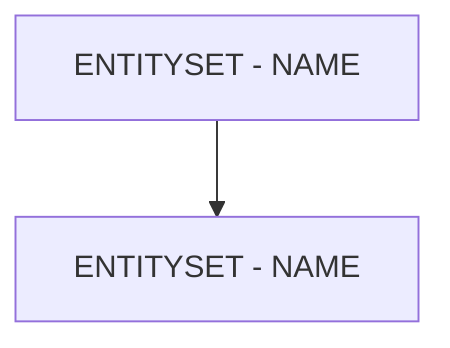

# 🌸 ENTITYSET - NAME

## 🌺 OBJECTIFS

- [ ] Expliquer le rôle de **ENTITYSET - NAME** dans le contexte présenté.
- [ ] Identifier les éléments techniques qui composent la notion.
- [ ] Appliquer la notion dans un exemple simple.
- [ ] Reconnaître les erreurs fréquentes et les limites de l’approche.

## 🌺 VUE D'ENSEMBLE



> [!IMPORTANT]
> Une modification du modèle OData peut nécessiter une nouvelle génération des artefacts d’exécution et une vérification du document `$metadata` consommé par les clients.

## 🌺 ENTITYSET - NAME

### 🍧 NAME

Le `Name` d’un `EntitySet` est l’identifiant unique utilisé dans l'`OData Service` pour référencer l’ensemble d’`Entities` (`EntitySet`). Il est visible dans le `$metadata` et utilisé par toutes les applications clientes pour accéder aux données.

### 🍧 DÉFINITION

- Identifiant unique de l’`EntitySet` dans l'`OData Service`.
- Utilisé pour construire l’`URL` d’accès aux `Entities` : `/EntitySetName(...)`.
- Correspond généralement au pluriel du nom de l’`EntityType` associé, mais peut être personnalisé.

### 🍧 RÔLE

- Sert de point d’accès principal aux données de l’`EntityType`.
- Permet aux applications consommatrices (`UI5`, `Postman`, `API`) de récupérer, filtrer et manipuler les `Entities`.
- Sert de référence pour les `Associations` et les relations entre `EntitySets`.

### 🍧 RÈGLES

| 🍧 Règle                          | 🍧 Explication                                   |
| --------------------------------- | ------------------------------------------------ |
| Unique dans le service            | Aucun autre EntitySet ne doit avoir le même Name |
| Nom clair et descriptif           | Facilite la lecture et l’intégration côté client |
| PascalCase recommandé             | Conformité avec les standards SAP et EDM         |
| Stable dans le temps              | Changer casse toutes les applications clientes   |
| Correspond souvent à l’EntityType | Typiquement pluriel du nom de l’EntityType       |

### 🍧 $METADATA EXAMPLES

```xml
<EntitySet Name="OutDelivSet" EntityType="ZLOG_KIT_CREATION_SRV.OutDeliv" sap:creatable="false" sap:updatable="false" sap:deletable="false" sap:pageable="false" sap:content-version="1"/>
<EntitySet Name="TaskSet" EntityType="ZLOG_KIT_CREATION_SRV.Task" sap:creatable="false" sap:updatable="false" sap:deletable="false" sap:pageable="false" sap:content-version="1"/>
<EntitySet Name="HuScanSet" EntityType="ZLOG_KIT_CREATION_SRV.HuScan" sap:creatable="false" sap:updatable="false" sap:deletable="false" sap:pageable="false" sap:content-version="1"/>
```

- `OutDelivSet` : permet d’accéder à toutes les `Entities` de type OutDeliv.
- `TaskSet` : permet d’accéder à toutes les `Entities` de type Task.
- `HuScanSet` : permet d’accéder à toutes les `Entities` de type HuScan.

### 🍧 ERREURS

| 🍧 Erreur                        | 🍧 Pourquoi c’est un problème                                   |
| -------------------------------- | --------------------------------------------------------------- |
| Name non unique                  | Conflit dans le service, applications clientes échouent         |
| Nom ambigu ou trop générique     | Difficulté pour les développeurs et consommateurs du service    |
| Changement après livraison       | Toutes les applications utilisant ce service risquent de casser |
| Utiliser des caractères spéciaux | Non conforme EDM, risque d’erreurs XML et parsing OData         |

## 🌺 RÉSUMÉ

> - **Entityset - name :** Le Name d’un EntitySet est l’identifiant unique utilisé dans l'OData Service pour référencer l’ensemble d’Entities (EntitySet).

<details>
<summary>🍧 Afficher l’auto-évaluation</summary>

- [ ] Je peux définir **ENTITYSET - NAME** avec mes propres mots.
- [ ] Je peux expliquer **entityset - name** sans relire le chapitre.
- [ ] Je peux appliquer ou illustrer **un exemple concret** dans un exemple simple.
- [ ] Je peux identifier au moins une erreur fréquente ou une limite liée à cette notion.

</details>
