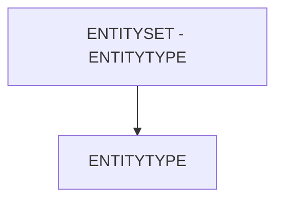

# 🌸 ENTITYSET - ENTITYTYPE

## 🌺 OBJECTIFS

- [ ] Expliquer le rôle de **ENTITYSET - ENTITYTYPE** dans le contexte présenté.
- [ ] Comprendre **entitytype**.
- [ ] Appliquer la notion dans un exemple simple.
- [ ] Reconnaître les erreurs fréquentes et les limites de l’approche.
## 🌺 VUE D'ENSEMBLE



> [!IMPORTANT]
> Une modification du modèle OData peut nécessiter une nouvelle génération des artefacts d’exécution et une vérification du document `$metadata` consommé par les clients.


## 🌺 ENTITYTYPE

Le champ `EntityType` d’un `EntitySet` définit l’`EntityType` que l’`EntitySet` contient. Il relie l'`EntitySet` à sa structure de données, c’est-à-dire les `Properties`, `Keys` et comportements définis dans l’`EntityType` correspondant.

### 🍧 DÉFINITION

- Référence à un `EntityType` existant dans l'`OData Service`.
- Définit la structure des `Entities` accessibles via l’`EntitySet` (`Properties`, `Keys`, `EDM Types`, `Annotations`).
- Assure la cohérence entre le `$metadata` et les données manipulées par les applications clientes.

### 🍧 RÔLE

- Fournit le `DataModel` pour toutes les `Entities` contenues dans l’`EntitySet`.
- Permet aux `Frameworks` (`UI5`, `Fiori Elements`, `analytics`) de générer automatiquement les formulaires, tables et validations.
- Sert de référence pour les `Associations`, liens et `Opérations` sur l’`EntitySet`.

### 🍧 RÈGLES

| 🍧 Règle                                 | 🍧 Explication                                                     |
| ---------------------------------------- | ------------------------------------------------------------------ |
| Doit référencer un EntityType existant   | Sinon, le service OData ne peut pas fonctionner                    |
| Stable dans le temps                     | Changer casse toutes les applications clientes                     |
| Cohérence avec le contenu de l’EntitySet | Les `Entities` du Set doivent respecter la structure du EntityType |
| Unique association                       | Chaque EntitySet ne peut référencer qu’un seul EntityType          |

### 🍧 $METADATA EXAMPLES

```xml
<EntitySet Name="OutDelivSet" EntityType="ZLOG_KIT_CREATION_SRV.OutDeliv" sap:creatable="false" sap:updatable="false" sap:deletable="false" sap:pageable="false" sap:content-version="1"/>
<EntitySet Name="TaskSet" EntityType="ZLOG_KIT_CREATION_SRV.Task" sap:creatable="false" sap:updatable="false" sap:deletable="false" sap:pageable="false" sap:content-version="1"/>
<EntitySet Name="HuScanSet" EntityType="ZLOG_KIT_CREATION_SRV.HuScan" sap:creatable="false" sap:updatable="false" sap:deletable="false" sap:pageable="false" sap:content-version="1"/>
```

- `OutDelivSet` → EntityType = OutDeliv : structure des commandes avec `Keys` et `Properties` définies dans OutDeliv.
- `TaskSet` → EntityType = Task : structure des clients avec toutes les `Properties` et `Keys` définies.
- `HuScanSet` → EntityType = HuScan : structure des clients avec toutes les `Properties` et `Keys` définies.

### 🍧 ERREURS

| 🍧 Erreur                                 | 🍧 Pourquoi c’est un problème                                       |
| ----------------------------------------- | ------------------------------------------------------------------- |
| EntityType inexistant                     | Génération du service échoue, EntitySet non accessible              |
| Changement après livraison                | Applications clientes ne reconnaissent plus la structure            |
| Incohérence avec les `Entities` contenues | Les données récupérées peuvent provoquer des erreurs côté UI5/Fiori |

## 🌺 RÉSUMÉ

> - **Entitytype :** Le champ EntityType d’un EntitySet définit l’EntityType que l’EntitySet contient.

<details>
<summary>🍧 Afficher l’auto-évaluation</summary>

- [ ] Je peux définir **ENTITYSET - ENTITYTYPE** avec mes propres mots.
- [ ] Je peux expliquer **entitytype** sans relire le chapitre.
- [ ] Je peux appliquer ou illustrer **un exemple concret** dans un exemple simple.
- [ ] Je peux identifier au moins une erreur fréquente ou une limite liée à cette notion.

</details>
