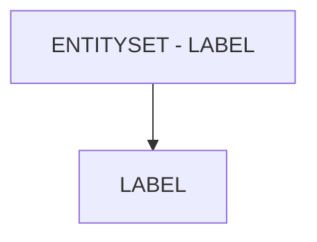

# 🌸 ENTITYSET - LABEL

## 🌺 OBJECTIFS

- [ ] Expliquer le rôle de **ENTITYSET - LABEL** dans le contexte présenté.
- [ ] Comprendre **label**.
- [ ] Appliquer la notion dans un exemple simple.
- [ ] Reconnaître les erreurs fréquentes et les limites de l’approche.

## 🌺 VUE D'ENSEMBLE



> [!IMPORTANT]
> Une modification du modèle OData peut nécessiter une nouvelle génération des artefacts d’exécution et une vérification du document `$metadata` consommé par les clients.

## 🌺 LABEL

Le `Label` d’un `EntitySet` définit le nom lisible et affichable pour l’`EntitySet` dans les applications clientes. Contrairement au `Name`, il n’affecte pas l'`OData Service` ou les `URLs`, mais sert uniquement à l’affichage et à la documentation.

### 🍧 DÉFINITION

- Texte court représentant l’`EntitySet` pour les `Final Users`.
- Peut contenir des espaces, accents ou caractères spéciaux.
- Stocké dans le metadata pour être utilisé par `UI5`/`Fiori`, `Fiori Elements` et autres outils SAP.

### 🍧 RÔLE

- Affichage dans les tables, listes et rapports côté `UI5`/`Fiori`.
- Facilite la compréhension pour les `Final Users` et les équipes métier.
- Sert à générer automatiquement les titres de colonnes et les `labels` de collections dans les applications.

### 🍧 RÈGLES

| 🍧 Règle                      | 🍧 Explication                                                |
| ----------------------------- | ------------------------------------------------------------- |
| Doit être clair et précis     | Facilite la lecture et la navigation pour les Final Users     |
| Langue cohérente              | Respecter la langue de l’application (ex. FR pour FR SAP UI5) |
| Stable dans le temps          | Changer casse la cohérence des écrans ou rapports             |
| Caractères spéciaux autorisés | Contrairement au Name, on peut utiliser espaces et accents    |
| Correspondre à l’EntitySet    | Ne pas confondre plusieurs EntitySets avec le même Label      |

### 🍧 $METADATA EXAMPLES

```xml
<EntitySet Name="SalesOrders" EntityType="Namespace.SalesOrder" sap:label="Commandes" />
<EntitySet Name="Customers" EntityType="Namespace.Customer" sap:label="Clients" />
```

- `SalesOrders` : affiché côté UI5/Fiori comme "Commandes"
- `Customers` : affiché comme "Clients"

### 🍧 ERREURS

| 🍧 Erreur                                 | 🍧 Pourquoi c’est un problème                                |
| ----------------------------------------- | ------------------------------------------------------------ |
| Label générique ou ambigu                 | Confusion pour les `Final Users`                             |
| Changement fréquent                       | Les écrans et rapports peuvent devenir incohérents           |
| Label identique pour plusieurs EntitySets | Difficulté à distinguer les collections dans l’interface     |
| Langue incohérente                        | UI5/Fiori risque de mélanger les libellés dans l’application |

## 🌺 RÉSUMÉ

> - **Label :** Le Label d’un EntitySet définit le nom lisible et affichable pour l’EntitySet dans les applications clientes.

<details>
<summary>🍧 Afficher l’auto-évaluation</summary>

- [ ] Je peux définir **ENTITYSET - LABEL** avec mes propres mots.
- [ ] Je peux expliquer **label** sans relire le chapitre.
- [ ] Je peux appliquer ou illustrer **un exemple concret** dans un exemple simple.
- [ ] Je peux identifier au moins une erreur fréquente ou une limite liée à cette notion.

</details>
