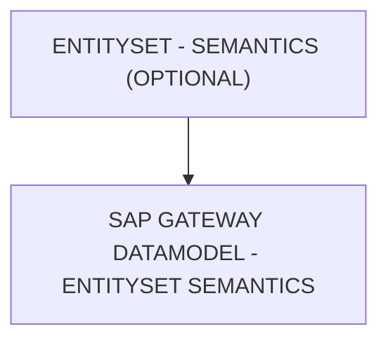

# 🌸 ENTITYSET - SEMANTICS (OPTIONAL)

## 🌺 OBJECTIFS

- [ ] Expliquer le rôle de **ENTITYSET - SEMANTICS (OPTIONAL)** dans le contexte présenté.
- [ ] Comprendre **sap gateway datamodel - entityset semantics**.
- [ ] Appliquer la notion dans un exemple simple.
- [ ] Reconnaître les erreurs fréquentes et les limites de l’approche.
## 🌺 VUE D'ENSEMBLE

> [!IMPORTANT]
> Une modification du modèle OData peut nécessiter une nouvelle génération des artefacts d’exécution et une vérification du document `$metadata` consommé par les clients.

## 🌺 SAP GATEWAY DATAMODEL - ENTITYSET SEMANTICS

La colonne `Semantics` d’un `EntitySet` définit la signification métier ou le rôle fonctionnel global de l’`EntitySet`. Elle indique aux applications clientes et `Frameworks SAP` comment traiter ou afficher cette collection.

### 🍧 DÉFINITION

- `Annotation SAP` qui décrit le type de contenu ou le rôle métier de l’`EntitySet`.
- Influence l’affichage, le format et le comportement dans `UI5`/`Fiori` et autres outils SAP.
- Ne modifie pas le type technique des `Entities`, mais fournit un contexte métier.

### 🍧 RÔLE

- Permet aux applications clientes de comprendre la nature de l’`EntitySet`.
- Facilite la génération automatique de listes, tables et rapports adaptés au type de données.
- Sert à appliquer des comportements standards selon la sémantique (ex. collection de transactions, master data, logs).

### 🍧 ERREURS

| 🍧 Erreur                   | 🍧 Pourquoi c’est un problème                                                          |
| --------------------------- | -------------------------------------------------------------------------------------- |
| Semantics non standard      | Les frameworks SAP ignorent la sémantique, affichage incorrect                         |
| Incohérence avec le contenu | Confusion côté frontend et comportement inadéquat                                      |
| Changement après livraison  | Applications clientes risquent d’interpréter incorrectement le EntitySet               |
| Semantics ambigu            | Difficile pour les développeurs et utilisateurs de comprendre le rôle de la collection |

## 🌺 RÉSUMÉ

> - **Sap gateway datamodel - entityset semantics :** La colonne Semantics d’un EntitySet définit la signification métier ou le rôle fonctionnel global de l’EntitySet.

🍧 Afficher l’auto-évaluation

- [ ] Je peux définir **ENTITYSET - SEMANTICS (OPTIONAL)** avec mes propres mots.
- [ ] Je peux expliquer **sap gateway datamodel - entityset semantics** sans relire le chapitre.
- [ ] Je peux appliquer ou illustrer **un exemple concret** dans un exemple simple.
- [ ] Je peux identifier au moins une erreur fréquente ou une limite liée à cette notion.

