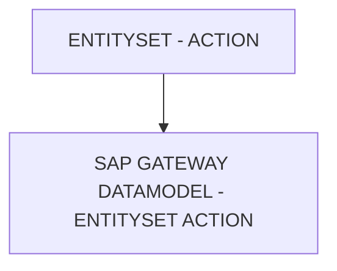

# 🌸 ENTITYSET - ACTION

## 🌺 OBJECTIFS

- [ ] Expliquer le rôle de **ENTITYSET - ACTION** dans le contexte présenté.
- [ ] Comprendre **sap gateway datamodel - entityset action**.
- [ ] Appliquer la notion dans un exemple simple.
- [ ] Reconnaître les erreurs fréquentes et les limites de l’approche.
## 🌺 VUE D'ENSEMBLE




## 🌺 SAP GATEWAY DATAMODEL - ENTITYSET ACTION

Les `Actions` d’un `EntitySet` définissent les `Opérations` permises sur l’`EntitySet` dans l'`OData Service`. Elles correspondent aux comportements globaux applicables à toutes les `Entities` de l’`EntitySet`.

> [!NOTE]
> Dans `OData V2` (et SEGW), l’absence d’une annotation d’action (`sap:creatable`, `sap:updatable`, `sap:deletable`) dans le `$metadata` est interprétée comme true par défaut.

### 🍧 DÉFINITION

- Indique si les `Entities` d’un EntitySet peuvent être créées, mises à jour ou encore supprimées.
- Contrôle l’accès global pour les `Opérations CRUD` côté `Service`.
- Stocké dans le `$metadata` via des `flags` ou `Annotations` comme `sap:creatable`, `sap:updatable`, `sap:deletable`.
- La possibilité d’`Action` sur l’`EntitySet` est conditionnée par l’`EntityType` : un `EntitySet` ne peut pas autoriser une `Action` que son `EntityType` interdit.

### 🍧 RÔLE

- Permet au `Framework SAP` et aux applications clientes (`UI5`/`Fiori`, `Postman`, `analytics`) de savoir quelles `Opérations` sont autorisées.
- Sert à générer automatiquement les formulaires, boutons ou menus correspondant aux actions autorisées.
- Garantit la cohérence métier et technique du service.
- Maintient l’intégrité entre `EntitySet` et `EntityType` : les actions créables, updatables ou deletables de l’`EntitySet` sont limitées par celles de l’`EntityType`.

### 🍧 RÈGLES

| 🍧 Règle                       | 🍧 Explication                                                     |
| ------------------------------ | ------------------------------------------------------------------ |
| Creatable                      | True si et seulement si l’EntityType est creatable                 |
| Updatable                      | True si et seulement si l’EntityType est updatable                 |
| Deletable                      | True si et seulement si l’EntityType est deletable                 |
| Stable après livraison         | Changer casse les comportements automatiques côté applications     |
| Cohérence avec les EntityTypes | Les flags doivent respecter les droits définis pour les propriétés |

### 🍧 $METADATA EXAMPLES

```xml
<EntitySet Name="SalesOrders" EntityType="Namespace.SalesOrder" sap:deletable="false"/>
<EntitySet Name="Customers" EntityType="Namespace.Customer" sap:creatable="false"/>
```

- `SalesOrders` : création et mise à jour autorisées, suppression interdite (limité par le `SalesOrder EntityType`).
- `Customers` : création interdite, mise à jour et suppression autorisées (limité par le `Customer EntityType`).

### 🍧 ERREURS

| 🍧 Erreur                                    | 🍧 Pourquoi c’est un problème                                     |
| -------------------------------------------- | ----------------------------------------------------------------- |
| Flags incohérents avec l’EntityType          | Risque d’erreur lors de l’exécution des `Opérations` côté service |
| Modification après livraison                 | Applications clientes peuvent tenter des actions non autorisées   |
| Suppression ou création autorisée par erreur | Peut compromettre l’intégrité des données métiers                 |

## 🌺 RÉSUMÉ

> - **Sap gateway datamodel - entityset action :** Les Actions d’un EntitySet définissent les Opérations permises sur l’EntitySet dans l'OData Service.

<details>
<summary>🍧 Afficher l’auto-évaluation</summary>

- [ ] Je peux définir **ENTITYSET - ACTION** avec mes propres mots.
- [ ] Je peux expliquer **sap gateway datamodel - entityset action** sans relire le chapitre.
- [ ] Je peux appliquer ou illustrer **un exemple concret** dans un exemple simple.
- [ ] Je peux identifier au moins une erreur fréquente ou une limite liée à cette notion.

</details>
