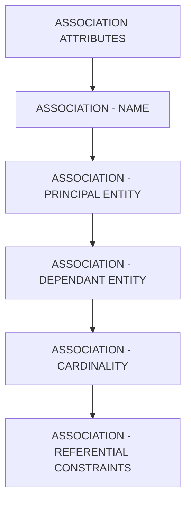

# 🌸 SOMMAIRE — ASSOCIATION ATTRIBUTES

## 🌺 OBJECTIFS DU COURS

- [ ] Comprendre la progression générale du cours.
- [ ] Identifier l’ordre conseillé des chapitres.
- [ ] Retrouver rapidement une notion précise.

## 🌺 PARCOURS

> [!IMPORTANT]
> Suivre les chapitres dans l’ordre numérique, sauf révision ciblée d’une notion déjà étudiée.

## 🌺 CHAPITRES

- [ASSOCIATION - NAME](<./01 - 🍧 ASSOCIATION - NAME.md>)
- [ASSOCIATION - PRINCIPAL ENTITY](<./02 - 🍧 ASSOCIATION - PRINCIPAL ENTITY.md>)
- [ASSOCIATION - DEPENDANT ENTITY](<./03 - 🍧 ASSOCIATION - DEPENDANT ENTITY.md>)
- [ASSOCIATION - CARDINALITY](<./04 - 🍧 ASSOCIATION - CARDINALITY.md>)
- [ASSOCIATION - REFERENTIAL CONSTRAINTS](<./06 - 🍧 ASSOCIATION - REFERENTIAL CONSTRAINTS.md>)

Afficher la méthode de travail

1. Lire les objectifs du chapitre.
2. Étudier le schéma Mermaid.
3. Reproduire les exemples.
4. Réaliser l’exercice sans consulter la correction.
5. Valider l’auto-évaluation.

## 🌺 RÉSUMÉ

> - Ce sommaire représente le parcours du cours **ASSOCIATION ATTRIBUTES**.
> - Les liens pointent vers les chapitres conservés dans leur emplacement d’origine.
