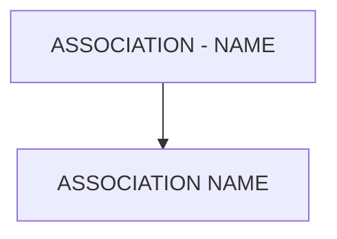

# 🌸 ASSOCIATION - NAME

## 🌺 OBJECTIFS

- [ ] Expliquer le rôle de **ASSOCIATION - NAME** dans le contexte présenté.
- [ ] Comprendre **association name**.
- [ ] Appliquer la notion dans un exemple simple.
- [ ] Reconnaître les erreurs fréquentes et les limites de l’approche.
## 🌺 VUE D'ENSEMBLE



> [!IMPORTANT]
> Une modification du modèle OData peut nécessiter une nouvelle génération des artefacts d’exécution et une vérification du document `$metadata` consommé par les clients.


## 🌺 ASSOCIATION NAME

Le `Name` d’une `Association` est l’identifiant technique unique de la relation entre deux `EntityTypes` dans l'`OData Service`. Il sert uniquement à définir et référencer la relation dans le `$metadata`.

### 🍧 DÉFINITION

- Identifiant unique de l’`Association` dans l'`OData Service`.
- Utilisé pour relier deux `EntityTypes` (`Principal` et `Dependant`).
- Visible dans le fichier `$metadata`, mais non utilisé directement par les applications clientes.

### 🍧 RÔLE

- Permet de définir une relation formelle entre deux `EntityTypes`.
- Sert de référence interne pour les `AssociationSets` et les `NavigationProperties`.
- Structure le `DataModel` relationnel de l'`OData Service`.

### 🍧 RÈGLES

| 🍧 Règle                    | 🍧 Explication                                               |
| --------------------------- | ------------------------------------------------------------ |
| Unique dans le service      | Deux associations ne peuvent pas porter le même nom          |
| Nom explicite et descriptif | Doit indiquer clairement la relation (ex. OrderToItems)      |
| PascalCase recommandé       | Convention SAP / EDM                                         |
| Stable dans le temps        | Changer casse les navigation properties et les apps clientes |
| Pas de caractères spéciaux  | Conformité EDM/XML                                           |

### 🍧 $METADATA EXAMPLES

```xml
<Association Name="SalesOrderToItems">
     <End Type="Namespace.SalesOrder" Role="Principal" Multiplicity="1" />
     <End Type="Namespace.SalesOrderItem" Role="Dependent" Multiplicity="*" />
</Association>
```

- `SalesOrderToItems` : relation entre `SalesOrder` et `SalesOrderItem`.
- Le nom est utilisé par l’`AssociationSet` et les `NavigationProperties`.

### 🍧 ERREURS

| 🍧 Erreur                      | 🍧 Pourquoi c’est un problème             |
| ------------------------------ | ----------------------------------------- |
| Nom générique (Link, Relation) | Modèle illisible et difficile à maintenir |
| Changement après livraison     | Toutes les navigations associées cassent  |
| Nom dupliqué                   | Génération du service impossible          |
| Nom non descriptif             | Ambiguïté sur le sens de la relation      |

## 🌺 RÉSUMÉ

> - **Association name :** Le Name d’une Association est l’identifiant technique unique de la relation entre deux EntityTypes dans l'OData Service.

<details>
<summary>🍧 Afficher l’auto-évaluation</summary>

- [ ] Je peux définir **ASSOCIATION - NAME** avec mes propres mots.
- [ ] Je peux expliquer **association name** sans relire le chapitre.
- [ ] Je peux appliquer ou illustrer **un exemple concret** dans un exemple simple.
- [ ] Je peux identifier au moins une erreur fréquente ou une limite liée à cette notion.

</details>
