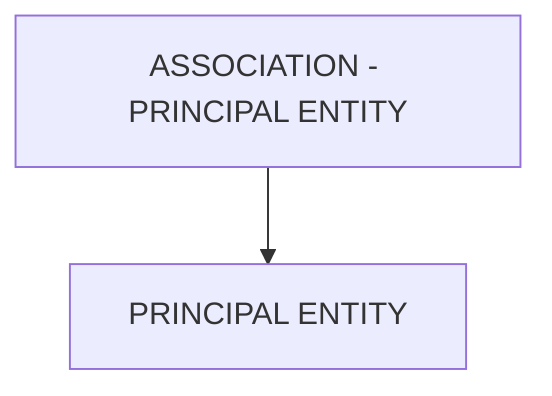

# 🌸 ASSOCIATION - PRINCIPAL ENTITY

## 🌺 OBJECTIFS

- [ ] Expliquer le rôle de **ASSOCIATION - PRINCIPAL ENTITY** dans le contexte présenté.
- [ ] Comprendre **principal entity**.
- [ ] Appliquer la notion dans un exemple simple.
- [ ] Reconnaître les erreurs fréquentes et les limites de l’approche.
## 🌺 VUE D'ENSEMBLE



> [!IMPORTANT]
> Une modification du modèle OData peut nécessiter une nouvelle génération des artefacts d’exécution et une vérification du document `$metadata` consommé par les clients.


## 🌺 PRINCIPAL ENTITY

La `Principal Entity` est l’`EntityType maître` dans une `Association`. Elle représente l’`Entity` de référence dont dépend l’autre `Entity` dans la relation définie.

### 🍧 DÉFINITION

- `EntityType` considéré comme parent ou maître dans l’`Association`.
- Référencé comme l’extrémité principale (Principal) dans le `$metadata`.
- Porte généralement la `Primary Key` utilisée par l’`Entity` dépendante.

### 🍧 RÔLE

- Définit le point d’ancrage de la relation.
- Permet aux applications clientes de naviguer depuis l’`Entity principale` vers l’`Entity dépendante`.
- Sert de base pour les règles de cohérence et d’intégrité relationnelle.

### 🍧 RÈGLES

| 🍧 Règle                                   | 🍧 Explication                                  |
| ------------------------------------------ | ----------------------------------------------- |
| Doit être un EntityType existant           | Sinon, l’association est invalide               |
| Généralement l’Entity maître               | Ex. Commande par rapport aux lignes de commande |
| Porte la clé référencée                    | La clé est utilisée par l’Entity dépendante     |
| Stable dans le temps                       | Changer casse les navigations et relations      |
| Une seule Principal Entity par association | Par définition EDM                              |

### 🍧 $METADATA EXAMPLES

```xml
<Association Name="SalesOrderToItems">
     <End Type="Namespace.SalesOrder" Role="Principal" Multiplicity="1" />
     <End Type="Namespace.SalesOrderItem" Role="Dependent" Multiplicity="*" />
</Association>
```

- `SalesOrder` : Principal Entity.
- `SalesOrderItem` : Entity dépendante liée à une commande.

### 🍧 ERREURS

| 🍧 Erreur                         | 🍧 Pourquoi c’est un problème                      |
| --------------------------------- | -------------------------------------------------- |
| Mauvais choix de Principal Entity | Modèle incohérent et navigation illogique          |
| EntityType inexistant             | Service OData invalide                             |
| Changement après livraison        | Rupture des relations et des applications clientes |
| Inversion Principal / Dependant   | Confusion métier et erreurs de navigation          |

## 🌺 RÉSUMÉ

> - **Principal entity :** La Principal Entity est l’EntityType maître dans une Association.

<details>
<summary>🍧 Afficher l’auto-évaluation</summary>

- [ ] Je peux définir **ASSOCIATION - PRINCIPAL ENTITY** avec mes propres mots.
- [ ] Je peux expliquer **principal entity** sans relire le chapitre.
- [ ] Je peux appliquer ou illustrer **un exemple concret** dans un exemple simple.
- [ ] Je peux identifier au moins une erreur fréquente ou une limite liée à cette notion.

</details>
