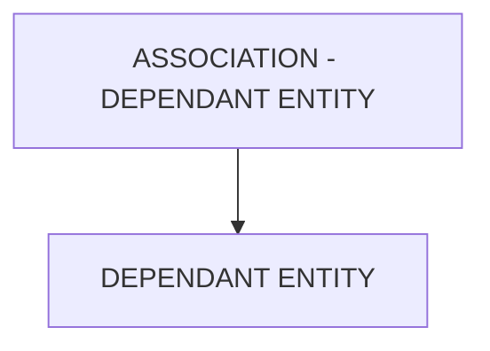

# 🌸 ASSOCIATION - DEPENDANT ENTITY

## 🌺 OBJECTIFS

- [ ] Expliquer le rôle de **ASSOCIATION - DEPENDANT ENTITY** dans le contexte présenté.
- [ ] Comprendre **dependant entity**.
- [ ] Appliquer la notion dans un exemple simple.
- [ ] Reconnaître les erreurs fréquentes et les limites de l’approche.
## 🌺 VUE D'ENSEMBLE



> [!IMPORTANT]
> Une modification du modèle OData peut nécessiter une nouvelle génération des artefacts d’exécution et une vérification du document `$metadata` consommé par les clients.


## 🌺 DEPENDANT ENTITY

La `Dependant Entity` est l’`EntityType` dépendant dans une `Association`. Elle représente l’`Entity` dont l’existence ou le sens métier dépend de la `Principal Entity`.

### 🍧 DÉFINITION

- `EntityType` considéré comme enfant ou dépendant dans l’`Association`.
- Référencé comme l’extrémité dépendante (Dependent) dans le `$metadata`.
- Contient généralement une `Foreign Key` pointant vers la `Key` de la `Principal Entity`.

### 🍧 RÔLE

- Représenter les données secondaires ou détaillées liées à une `principal Entity` .
- Permettre la `Navigation` depuis la `Principal Entity` vers les données dépendantes.
- Assurer la cohérence relationnelle entre les `Entities` de l'`OData Model`.

### 🍧 RÈGLES

| 🍧 Règle                                   | 🍧 Explication                                  |
| ------------------------------------------ | ----------------------------------------------- |
| Doit être un EntityType existant           | Sinon, l’association est invalide               |
| Dépend de la Principal Entity              | Son sens métier est lié à l’`Entity` principale |
| Contient la clé de liaison                 | Référence la clé de la Principal Entity         |
| Stable dans le temps                       | Changer casse les navigations et relations      |
| Une seule Dependant Entity par association | Par définition EDM                              |

### 🍧 $METADATA EXAMPLES

```xml
    <Association Name="SalesOrderToItems">
        <End Type="Namespace.SalesOrder" Role="Principal" Multiplicity="1" />
        <End Type="Namespace.SalesOrderOrderItem" Role="Dependent" Multiplicity="*" />
    </Association>
```

- `SalesOrderItem` : Dependant Entity.
- Chaque ligne de commande dépend d’une commande.

### 🍧 ERREURS

| 🍧 Erreur                                | 🍧 Pourquoi c’est un problème                        |
| ---------------------------------------- | ---------------------------------------------------- |
| Choisir une Entity indépendante          | Relation métier incohérente                          |
| EntityType inexistant                    | Service OData invalide                               |
| Changer après livraison                  | Rupture des navigations et des applications clientes |
| Mauvaise compréhension du rôle dépendant | Modèle confus et difficile à maintenir               |

## 🌺 RÉSUMÉ

> - **Dependant entity :** La Dependant Entity est l’EntityType dépendant dans une Association.

<details>
<summary>🍧 Afficher l’auto-évaluation</summary>

- [ ] Je peux définir **ASSOCIATION - DEPENDANT ENTITY** avec mes propres mots.
- [ ] Je peux expliquer **dependant entity** sans relire le chapitre.
- [ ] Je peux appliquer ou illustrer **un exemple concret** dans un exemple simple.
- [ ] Je peux identifier au moins une erreur fréquente ou une limite liée à cette notion.

</details>
