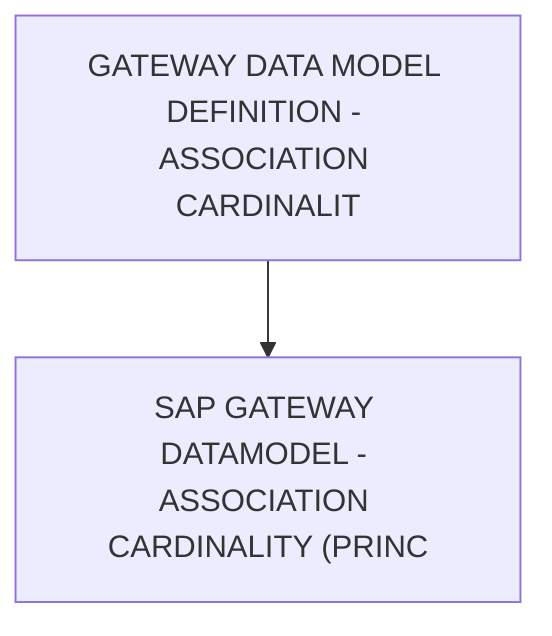

# 🌸 GATEWAY DATA MODEL DEFINITION - ASSOCIATION CARDINALITY

## 🌺 OBJECTIFS

- [ ] Expliquer le rôle de **GATEWAY DATA MODEL DEFINITION - ASSOCIATION CARDINALITY** dans le contexte présenté.
- [ ] Comprendre **sap gateway datamodel - association cardinality (principal / dependant)**.
- [ ] Appliquer la notion dans un exemple simple.
- [ ] Reconnaître les erreurs fréquentes et les limites de l’approche.

## 🌺 VUE D'ENSEMBLE



> [!IMPORTANT]
> Une modification du modèle OData peut nécessiter une nouvelle génération des artefacts d’exécution et une vérification du document `$metadata` consommé par les clients.

## 🌺 SAP GATEWAY DATAMODEL - ASSOCIATION CARDINALITY (PRINCIPAL / DEPENDANT)

La `Cardinality` définit le nombre d’occurrences possibles entre la `Principal Entity` et la `Dependant Entity` dans une `Association`. Elle décrit la relation quantitative entre les deux `Entities`.

### 🍧 DÉFINITION

- Indique combien d’instances d’une `Entity` peuvent être liées à une instance de l’autre `Entity`.
- Définie séparément pour la `Principal Entity` et la `Dependant Entity`.
- Exprimée dans le $metadata via la `Property Multiplicity`.

### 🍧 RÔLE

- Définir clairement les relations de cardinalité.
- Permettre aux `Frameworks SAP` et `UI5` de générer des `Navigations` correctes.
- Garantir la cohérence métier et technique du `DataModel`.

### 🍧 RÈGLES

| 🍧 Règle                                    | 🍧 Explication                                          |
| ------------------------------------------- | ------------------------------------------------------- |
| Cardinalité cohérente avec le modèle métier | Doit refléter la réalité fonctionnelle                  |
| 1:n le cas le plus courant                  | Principal = 1, Dependant = n                            |
| 1:1 utilisé avec parcimonie                 | Relation forte, souvent extension de données            |
| n:m nécessite table intermédiaire           | Non supporté directement par une seule association SEGW |
| Stable après livraison                      | Changer casse les navigations et applications clientes  |

### 🍧 $METADATA EXAMPLES

```xml
<Association Name="SalesOrderToItems">
     <End Type="Namespace.SalesOrder" Role="Principal" Multiplicity="1" />
     <End Type="Namespace.SalesOrderItem" Role="Dependent" Multiplicity="*" />
</Association>
```

- Une commande (SalesOrder) possède plusieurs lignes (SalesOrderItem).
- Relation 1:n.

```xml
<Association Name="UserToProfile">
    <End Type="Namespace.User" Role="Principal" Multiplicity="1" />
    <End Type="Namespace.Profile" Role="Dependent" Multiplicity="0..1" />
</Association>
```

- Un utilisateur possède zéro ou un profil.
- Relation 1:0..1.

### 🍧 ERREURS

| 🍧 Erreur                              | 🍧 Pourquoi c’est un problème                        |
| -------------------------------------- | ---------------------------------------------------- |
| Cardinalité incorrecte                 | Navigations incohérentes et erreurs métier           |
| Utiliser n:m sans Entity intermédiaire | Modèle non supporté correctement                     |
| Changer après livraison                | Rupture des navigations et des applications clientes |
| Incohérence Principal / Dependant      | Modèle difficile à comprendre et à maintenir         |

## 🌺 RÉSUMÉ

> - **Sap gateway datamodel - association cardinality (principal / dependant) :** La Cardinality définit le nombre d’occurrences possibles entre la Principal Entity et la Dependant Entity dans une Association.

<details>
<summary>🍧 Afficher l’auto-évaluation</summary>

- [ ] Je peux définir **GATEWAY DATA MODEL DEFINITION - ASSOCIATION CARDINALITY** avec mes propres mots.
- [ ] Je peux expliquer **sap gateway datamodel - association cardinality (principal / dependant)** sans relire le chapitre.
- [ ] Je peux appliquer ou illustrer **un exemple concret** dans un exemple simple.
- [ ] Je peux identifier au moins une erreur fréquente ou une limite liée à cette notion.

</details>
