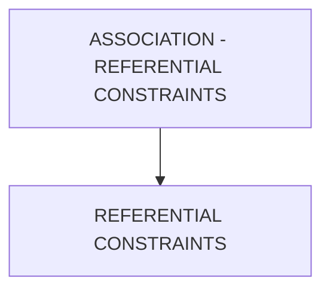

# 🌸 ASSOCIATION - REFERENTIAL CONSTRAINTS

## 🌺 OBJECTIFS

- [ ] Expliquer le rôle de **ASSOCIATION - REFERENTIAL CONSTRAINTS** dans le contexte présenté.
- [ ] Comprendre **referential constraints**.
- [ ] Appliquer la notion dans un exemple simple.
- [ ] Reconnaître les erreurs fréquentes et les limites de l’approche.
## 🌺 VUE D'ENSEMBLE



> [!IMPORTANT]
> Une modification du modèle OData peut nécessiter une nouvelle génération des artefacts d’exécution et une vérification du document `$metadata` consommé par les clients.


## 🌺 REFERENTIAL CONSTRAINTS

Les `Referential Constraints` définissent la règle de liaison technique entre la `Principal Entity` et la `Dependant Entity`. Elles indiquent quelle `Key` de la `Principal Entity` est référencée par quelle `Property` de `Dependant Entity`.

### 🍧 DÉFINITION

- Règle qui relie une `Primary Key` de la `Principal Entity` à une `Foreign Key` de la `Dependant Entity`.
- Définie au niveau de l’`Association` dans le `$metadata`.
- Garantit l’intégrité relationnelle entre les `Entities`.

### 🍧 RÔLE

- Assurer que chaque `Entity` dépendante est liée à une `Principal Entity` valide.
- Permettre aux `Frameworks SAP` et `UI5` de comprendre la relation `Key`-`Key`.
- Activer les `Navigations` correctes entre `EntitySets`.
- Servir de base aux jointures automatiques et aux contrôles de cohérence.

### 🍧 STRUCTURE

Un `Referential Constraint` est composé de deux éléments :

- `Principal Property` :
  `Property` `Key` de la `Principal Entity` (`Primary Key`).

- `Dependent Property` :
  `Property` de la `Dependant Entity` qui référence la `Primary Key` (`Foreign Key`).

### 🍧 RÈGLES

| 🍧 Règle                                  | 🍧 Explication                                              |
| ----------------------------------------- | ----------------------------------------------------------- |
| La Principal Property doit être une `Key` | Toujours une `Property` définie comme Key dans l’EntityType |
| La Dependent Property référence la `Key`  | Doit contenir la valeur de la `Key` principale              |
| Types compatibles                         | Les deux `Property`s doivent avoir le même type EDM         |
| Une relation claire 1 → n ou 1 → 1        | Pas d’ambiguïté sur la relation                             |
| Stable après livraison                    | Changer casse les navigations et les applications clientes  |

### 🍧 $METADATA EXAMPLES

```xml
<Association Name="DelivToTask" sap:content-version="1">
	<End Type="ZLOG_KIT_CREATION_SRV.OutDeliv" Multiplicity="1" Role="FromRole_DelivToTask"/>
	<End Type="ZLOG_KIT_CREATION_SRV.Task" Multiplicity="*" Role="ToRole_DelivToTask"/>
	<ReferentialConstraint>
		<Principal Role="FromRole_DelivToTask">
			<PropertyRef Name="Docno"/>
		</Principal>
		<Dependent Role="ToRole_DelivToTask">
			<PropertyRef Name="Docno"/>
		</Dependent>
	</ReferentialConstraint>
</Association>
```

### 🍧 ERREURS

| 🍧 Erreur                              | 🍧 Pourquoi c’est un problème                      |
| -------------------------------------- | -------------------------------------------------- |
| `Property` principale non `Key`        | Relation invalide, incohérence des données         |
| Types différents entre les `Property`s | Jointure impossible                                |
| Mauvais champ référencé côté dépendant | Navigation incorrecte ou données incohérentes      |
| Omission du Referential Constraint     | Navigation possible mais intégrité non garantie    |
| Changement après livraison             | Rupture des relations et des applications clientes |

## 🌺 RÉSUMÉ

> - **Referential constraints :** Les Referential Constraints définissent la règle de liaison technique entre la Principal Entity et la Dependant Entity.

<details>
<summary>🍧 Afficher l’auto-évaluation</summary>

- [ ] Je peux définir **ASSOCIATION - REFERENTIAL CONSTRAINTS** avec mes propres mots.
- [ ] Je peux expliquer **referential constraints** sans relire le chapitre.
- [ ] Je peux appliquer ou illustrer **un exemple concret** dans un exemple simple.
- [ ] Je peux identifier au moins une erreur fréquente ou une limite liée à cette notion.

</details>
