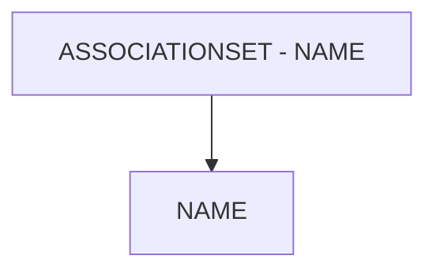

# 🌸 ASSOCIATIONSET - NAME

## 🌺 OBJECTIFS

- [ ] Expliquer le rôle de **ASSOCIATIONSET - NAME** dans le contexte présenté.
- [ ] Comprendre **name**.
- [ ] Appliquer la notion dans un exemple simple.
- [ ] Reconnaître les erreurs fréquentes et les limites de l’approche.
## 🌺 VUE D'ENSEMBLE



> [!IMPORTANT]
> Une modification du modèle OData peut nécessiter une nouvelle génération des artefacts d’exécution et une vérification du document `$metadata` consommé par les clients.


## 🌺 NAME

Le `Name` d’un `AssociationSet` est l’identifiant technique de l’instance d’`Association` exposée dans l'`OData Service`. Il relie concrètement deux `EntitySets` via une `Association`.

### 🍧 DÉFINITION

- Nom technique de l’`AssociationSet` dans l'`OData Service`.
- Représente l’instance d’une `Association` entre deux `EntitySets`.
- Apparaît dans le `$metadata` sous le `node` `<AssociationSet>`.

### 🍧 RÔLE

- Lier une `Association` à des `EntitySets` concrets.
- Permettre aux `OData Navigations` de fonctionner entre `EntitySets`.
- Servir de point de résolution entre modèle conceptuel (`Association`) et `Exposition` du service.

### 🍧 RÈGLES

| 🍧 Règle                                  | 🍧 Explication                                        |
| ----------------------------------------- | ----------------------------------------------------- |
| Unique dans le Service                    | Deux AssociationSets ne peuvent pas avoir le même nom |
| Doit référencer une Association existante | Sinon, le service est invalide                        |
| Convention de nommage claire              | Souvent basé sur les EntitySets liés                  |
| Pas d’espaces ni caractères spéciaux      | Conformité EDM / XML                                  |
| Stable après livraison                    | Changer casse les Navigations clientes                |

Conventions courantes :

- `<EntitySetPrincipal>To<EntitySetDependent>`
- `<EntitySet1>_<EntitySet2>`

### 🍧 $METADATA EXAMPLES

```xml
<AssociationSet Name="DelivToTaskSet" Association="ZLOG_KIT_CREATION_SRV.DelivToTask" sap:creatable="false" sap:updatable="false" sap:deletable="false" sap:content-version="1">
	<End EntitySet="OutDelivSet" Role="FromRole_DelivToTask"/>
	<End EntitySet="TaskSet" Role="ToRole_DelivToTask"/>
</AssociationSet>
```

### 🍧 ERREURS

| 🍧 Erreur                       | 🍧 Pourquoi c’est un problème     |
| ------------------------------- | --------------------------------- |
| Nom générique ou ambigu         | Modèle illisible                  |
| Association inexistante         | Service OData invalide            |
| Incohérence avec les EntitySets | Navigation impossible             |
| Changer le Name après livraison | Rupture des applications clientes |

## 🌺 RÉSUMÉ

> - **Name :** Le Name d’un AssociationSet est l’identifiant technique de l’instance d’Association exposée dans l'OData Service.

<details>
<summary>🍧 Afficher l’auto-évaluation</summary>

- [ ] Je peux définir **ASSOCIATIONSET - NAME** avec mes propres mots.
- [ ] Je peux expliquer **name** sans relire le chapitre.
- [ ] Je peux appliquer ou illustrer **un exemple concret** dans un exemple simple.
- [ ] Je peux identifier au moins une erreur fréquente ou une limite liée à cette notion.

</details>
