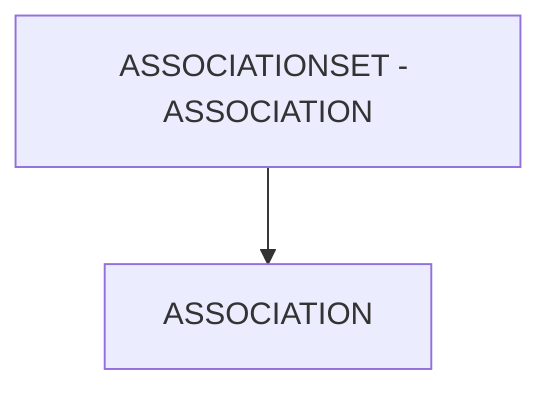

# 🌸 ASSOCIATIONSET - ASSOCIATION

## 🌺 OBJECTIFS

- [ ] Expliquer le rôle de **ASSOCIATIONSET - ASSOCIATION** dans le contexte présenté.
- [ ] Comprendre **association**.
- [ ] Appliquer la notion dans un exemple simple.
- [ ] Reconnaître les erreurs fréquentes et les limites de l’approche.
## 🌺 VUE D'ENSEMBLE



> [!IMPORTANT]
> Une modification du modèle OData peut nécessiter une nouvelle génération des artefacts d’exécution et une vérification du document `$metadata` consommé par les clients.


## 🌺 ASSOCIATION

Le champ `Association` d’un `AssociationSet` référence l’`Association` conceptuelle qui définit la relation entre deux `EntityTypes`. L’`AssociationSet` en est l’implémentation concrète au niveau des `EntitySets`.

### 🍧 DÉFINITION

- Référence explicite vers une `Association` existante du modèle.
- Fait le lien entre :
  - l’`Association` (`EntityType` ↔ `EntityType`),
  - et l’`AssociationSet` (`EntitySet` ↔ `EntitySet`).
- Obligatoire pour qu’un `AssociationSet` soit valide.

### 🍧 RÔLE

- Indiquer quelle relation conceptuelle est utilisée par l’`AssociationSet`.
- Permettre à l'`OData Runtime` de résoudre correctement les `Navigations`.
- Garantir la cohérence entre `EntityTypes` et `EntitySets`.

### 🍧 RÈGLES

| 🍧 Règle                                          | 🍧 Explication                                                       |
| ------------------------------------------------- | -------------------------------------------------------------------- |
| Doit référencer une Association existante         | Sinon, erreur de génération ou de runtime                            |
| Nom entièrement qualifié                          | Inclut le namespace (`Namespace.AssociationName`)                    |
| Une Association peut être utilisée plusieurs fois | Par différents AssociationSets                                       |
| Cohérence avec les EntitySets                     | Les EntitySets doivent correspondre aux EntityTypes de l’Association |
| Stable après livraison                            | Changer casse les navigations clientes                               |

### 🍧 $METADATA EXAMPLES

```xml
<AssociationSet Name="DelivToTaskSet" Association="ZLOG_KIT_CREATION_SRV.DelivToTask" sap:creatable="false" sap:updatable="false" sap:deletable="false" sap:content-version="1">
	<End EntitySet="OutDelivSet" Role="FromRole_DelivToTask"/>
	<End EntitySet="TaskSet" Role="ToRole_DelivToTask"/>
</AssociationSet>
```

### 🍧 ERREURS

| 🍧 Erreur                              | 🍧 Pourquoi c’est un problème                    |
| -------------------------------------- | ------------------------------------------------ |
| Référencer une Association inexistante | Service OData invalide                           |
| Mauvaise Association utilisée          | Navigations incohérentes                         |
| Incohérence EntityType / EntitySet     | Erreurs de résolution au runtime                 |
| Changer l’Association après livraison  | Rupture des navigations et applications clientes |

## 🌺 RÉSUMÉ

> - **Association :** Le champ Association d’un AssociationSet référence l’Association conceptuelle qui définit la relation entre deux EntityTypes.

<details>
<summary>🍧 Afficher l’auto-évaluation</summary>

- [ ] Je peux définir **ASSOCIATIONSET - ASSOCIATION** avec mes propres mots.
- [ ] Je peux expliquer **association** sans relire le chapitre.
- [ ] Je peux appliquer ou illustrer **un exemple concret** dans un exemple simple.
- [ ] Je peux identifier au moins une erreur fréquente ou une limite liée à cette notion.

</details>
