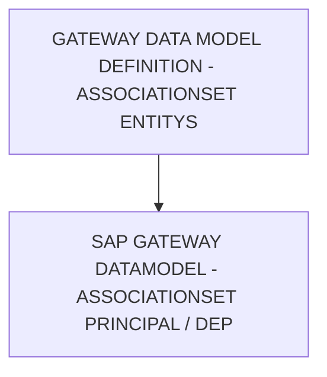

# 🌸 GATEWAY DATA MODEL DEFINITION - ASSOCIATIONSET ENTITYSET NAMES

## 🌺 OBJECTIFS

- [ ] Expliquer le rôle de **GATEWAY DATA MODEL DEFINITION - ASSOCIATIONSET ENTITYSET NAMES** dans le contexte présenté.
- [ ] Comprendre **sap gateway datamodel - associationset principal / dependant entityset**.
- [ ] Appliquer la notion dans un exemple simple.
- [ ] Reconnaître les erreurs fréquentes et les limites de l’approche.

## 🌺 VUE D'ENSEMBLE



> [!IMPORTANT]
> Une modification du modèle OData peut nécessiter une nouvelle génération des artefacts d’exécution et une vérification du document `$metadata` consommé par les clients.

## 🌺 SAP GATEWAY DATAMODEL - ASSOCIATIONSET PRINCIPAL / DEPENDANT ENTITYSET

Les champs `Principal EntitySet Name` et `Dependant EntitySet Name` définissent quels `EntitySets` concrets sont liés par l’`AssociationSet`. Ils matérialisent la relation au niveau exposé de l'`OData Service`.

### 🍧 DÉFINITION

- `Principal EntitySet Name` :
  `EntitySet` correspondant à la `Principal Entity` de l’`Association`.

- `Dependant EntitySet Name` :
  `EntitySet` correspondant à la `Dependant Entity` de l’`Association`.

Ces deux champs relient une `Association` (conceptuelle) à des `EntitySets` réellement exposés.

### 🍧 RÔLE

- Déterminer le point de départ et le point d’arrivée des `OData Navigations`.
- Relier le modèle `Conceptuel` (`EntityType`) à l’`Exposition` réelle (`EntitySet`).
- Permettre les accès du type :
  `/PrincipalEntitySet(key)/NavigationProperty`

### 🍧 RÈGLES

| 🍧 Règle                                                      | 🍧 Explication                                                     |
| ------------------------------------------------------------- | ------------------------------------------------------------------ |
| EntitySet existant obligatoire                                | Doit être défini dans le service                                   |
| Correspondance avec l’Association                             | Chaque EntitySet doit correspondre à l’EntityType de l’Association |
| Respect des rôles Principal / Dependant                       | Alignement strict avec les rôles définis dans l’Association        |
| Un EntitySet peut être utilisé dans plusieurs AssociationSets | Relation réutilisable                                              |
| Stable après livraison                                        | Changer casse les navigations clientes                             |

### 🍧 $METADATA EXAMPLES

```xml
<AssociationSet Name="DelivToTaskSet" Association="ZLOG_KIT_CREATION_SRV.DelivToTask" sap:creatable="false" sap:updatable="false" sap:deletable="false" sap:content-version="1">
	<End EntitySet="OutDelivSet" Role="FromRole_DelivToTask"/>
	<End EntitySet="TaskSet" Role="ToRole_DelivToTask"/>
</AssociationSet>
```

### 🍧 ERREURS

| 🍧 Erreur                              | 🍧 Pourquoi c’est un problème     |
| -------------------------------------- | --------------------------------- |
| EntitySet inexistant                   | Service OData invalide            |
| Mauvais mapping EntityType / EntitySet | Navigation impossible             |
| Inversion Principal / Dependant        | Modèle incohérent                 |
| Changement après livraison             | Rupture des applications clientes |

## 🌺 RÉSUMÉ

> - **Sap gateway datamodel - associationset principal / dependant entityset :** Les champs Principal EntitySet Name et Dependant EntitySet Name définissent quels EntitySets concrets sont liés par l’AssociationSet.

<details>
<summary>🍧 Afficher l’auto-évaluation</summary>

- [ ] Je peux définir **GATEWAY DATA MODEL DEFINITION - ASSOCIATIONSET ENTITYSET NAMES** avec mes propres mots.
- [ ] Je peux expliquer **sap gateway datamodel - associationset principal / dependant entityset** sans relire le chapitre.
- [ ] Je peux appliquer ou illustrer **un exemple concret** dans un exemple simple.
- [ ] Je peux identifier au moins une erreur fréquente ou une limite liée à cette notion.

</details>
