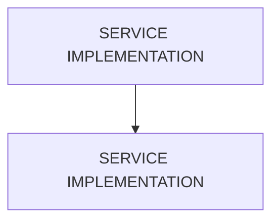

# 🌸 SERVICE IMPLEMENTATION

## 🌺 VUE D'ENSEMBLE

> [!IMPORTANT]
> Une modification du modèle OData peut nécessiter une nouvelle génération des artefacts d’exécution et une vérification du document `$metadata` consommé par les clients.

## 🌺 OBJECTIFS

- [ ] Identifier les méthodes natives

## 🌺 SERVICE IMPLÉMENTATION

Dans la branche `Service Implementation`, le `SAP Gateway Service Builder` permet d'accéder facilement à l'`implémentation ABAP` dans l'`ABAP Workbench` (`SE80`), prenant en charge les différentes `OData Operations` d'un `EntitySet`.

Pour chaque `EntitySet`, cinq méthodes sont générées afin de refléter les opérations `CRUD` :

- `Create`
- `Read`
- `Read` (multiple entries)
- `Update`
- `Delete`

Pour plus de simplicité, l'opération `Read` est divisée en une méthode de lecture et une méthode query (d'interrogation). Cela simplifie le développement en séparant la lecture d'un `single data set` (ensemble de données unique) à l'aide d'une `Key` des `query Operations` telles que le `sorting` ou le `filtering`.

Par exemple, pour un `EntitySet` nommé `BusinessPartnerSet`, les méthodes suivantes sont créées :

- `BUSINESSPARTNERSET_CREATE_ENTITY` (Create)
- `BUSINESSPARTNERSET_GET_ENTITY` (Read)
- `BUSINESSPARTNERSET_GET_ENTITYSET` (Read multiple entries)
- `BUSINESSPARTNERSET_UPDATE_ENTITY` (Update)
- `BUSINESSPARTNERSET_DELETE_ENTITY` (Delete)

Par exemple, pour un `EntitySet` nommé `ProductSet`, les méthodes suivantes sont créées :

- `PRODUCTSET_CREATE_ENTITY` (Create)
- `PRODUCTSET_GET_ENTITY` (Read)
- `PRODUCTSET_GET_ENTITYSET` (Read multiple entries)
- `PRODUCTSET_UPDATE_ENTITY` (Update)
- `PRODUCTSET_DELETE_ENTITY` (Delete)

Chaque méthode correspond directement aux actions exposées dans le `$metadata`.

## 🌺 RÉSUMÉ

> - **Service implémentation :** Dans la branche Service Implementation, le SAP Gateway Service Builder permet d'accéder facilement à l'implémentation ABAP dans l'ABAP Workbench (SE80), prenant en charge les différentes OData Operations d'un EntitySet.

🍧 Afficher l’auto-évaluation

- [ ] Je peux définir **SERVICE IMPLEMENTATION** avec mes propres mots.
- [ ] Je peux expliquer **objectives** sans relire le chapitre.
- [ ] Je peux appliquer ou illustrer **service implementation** dans un exemple simple.
- [ ] Je peux identifier au moins une erreur fréquente ou une limite liée à cette notion.

