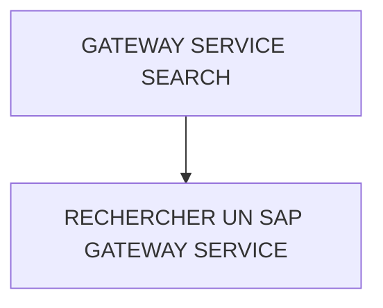

# 🌸 GATEWAY SERVICE SEARCH

## 🌺 VUE D'ENSEMBLE

## 🌺 OBJECTIFS

- [ ] Rechercher un `SAP Gateway Service` exposé

## 🌺 RECHERCHER UN SAP GATEWAY SERVICE

### 🍧 TRANSACTION /N/IWFND/MAINT_SERVICE

> [!NOTE]
> Un statut vert indique que le nœud ICF sélectionné est actif. Il ne prouve pas que le service est enregistré avec le bon alias ni que son implémentation fonctionne.

### 🍧 CONTRÔLES À EFFECTUER

1. Rechercher le nom technique `<SERVICE>_SRV` dans `/IWFND/MAINT_SERVICE`.
2. Vérifier le système alias associé. Il doit désigner le système qui fournit l'implémentation.
3. Vérifier que le nœud ICF `ODATA` est actif.
4. Ouvrir `SAP Gateway Client` depuis le service.
5. Exécuter `/sap/opu/odata/SAP/<SERVICE>_SRV/$metadata`.
6. Attendre `200 OK` et un document contenant les EntityTypes et EntitySets du projet.
7. Exécuter ensuite l'URI racine `/sap/opu/odata/SAP/<SERVICE>_SRV/` pour contrôler le document de service.

| Résultat | Interprétation initiale |
| --- | --- |
| Service absent de la liste | Service non enregistré sur ce hub ou filtre de recherche incorrect |
| Nœud ICF inactif | Activer le nœud avec les autorisations requises |
| `404 Not Found` | Nom technique ou chemin incorrect, ou service non enregistré |
| `500 Internal Server Error` | Consulter `/IWFND/ERROR_LOG` et le journal backend |

Source : SAP SE, *Activate O-Data Services*, version 2505, consultée le 4 août 2026 : https://help.sap.com/docs/SAP_Best_Practices/11a28450dbf7490a86d5b22ac423ecc6/0da364382b554805aff39e5820e1d730.html

## 🌺 RÉSUMÉ

> - Retrouver le service, vérifier son alias et son nœud ICF, puis valider `$metadata` dans Gateway Client.

🍧 Afficher l’auto-évaluation

- [ ] Je peux définir **GATEWAY SERVICE SEARCH** avec mes propres mots.
- [ ] Je peux expliquer **objectives** sans relire le chapitre.
- [ ] Je peux appliquer ou illustrer **rechercher un sap gateway service** dans un exemple simple.
- [ ] Je peux identifier au moins une erreur fréquente ou une limite liée à cette notion.

