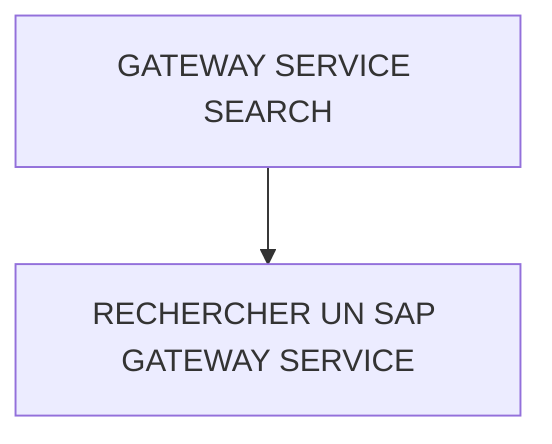

# 🌸 GATEWAY SERVICE SEARCH

## 🌺 VUE D'ENSEMBLE

## 🌺 OBJECTIFS

- [ ] Rechercher un `SAP Gateway Service` exposé

## 🌺 RECHERCHER UN SAP GATEWAY SERVICE

### 🍧 TRANSACTION /N/IWFND/MAINT_SERVICE

> [!NOTE]
> Si le Statut du `ICF Node` est `Green`, tout va bien ! `ODATA` ici correspond au `HTTP Service`.

## 🌺 RÉSUMÉ

> - Savoir utiliser **rechercher un sap gateway service** dans le contexte présenté.

🍧 Afficher l’auto-évaluation

- [ ] Je peux définir **GATEWAY SERVICE SEARCH** avec mes propres mots.
- [ ] Je peux expliquer **objectives** sans relire le chapitre.
- [ ] Je peux appliquer ou illustrer **rechercher un sap gateway service** dans un exemple simple.
- [ ] Je peux identifier au moins une erreur fréquente ou une limite liée à cette notion.

