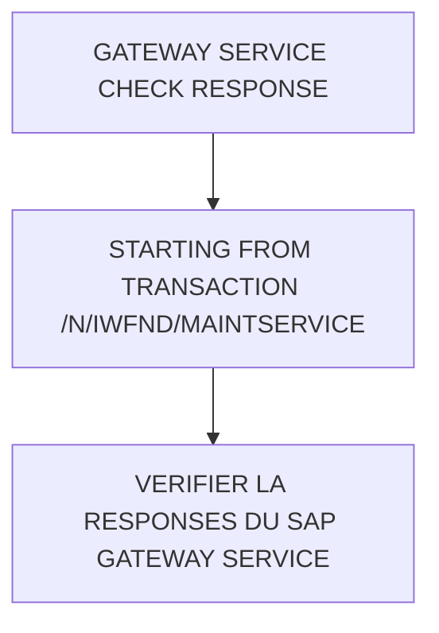

# 🌸 GATEWAY SERVICE CHECK RESPONSE

## 🌺 VUE D'ENSEMBLE

## 🌺 OBJECTIFS

- [ ] Vérifier que le Service est accessible et répond correctement

## 🌺 STARTING FROM TRANSACTION /N/IWFND/MAINT_SERVICE

> [!NOTE]
> Cette nouvelle fenêtre correspond à la transaction `/N/IWFND/GW_CLIENT` (SAP Gateway Client) permettant de tester les `Requests` au `Gateway Service` ciblé.

## 🌺 VERIFIER LA RESPONSES DU SAP GATEWAY SERVICE

### 🍧 TRANSACTION /N/IWFND/GW_CLIENT

## 🌺 RÉSUMÉ

> - Savoir utiliser **starting from transaction /n/iwfnd/maint_service** dans le contexte présenté.
> - Savoir utiliser **verifier la responses du sap gateway service** dans le contexte présenté.

🍧 Afficher l’auto-évaluation

- [ ] Je peux définir **GATEWAY SERVICE CHECK RESPONSE** avec mes propres mots.
- [ ] Je peux expliquer **objectives** sans relire le chapitre.
- [ ] Je peux appliquer ou illustrer **starting from transaction /n/iwfnd/maint_service** dans un exemple simple.
- [ ] Je peux identifier au moins une erreur fréquente ou une limite liée à cette notion.

