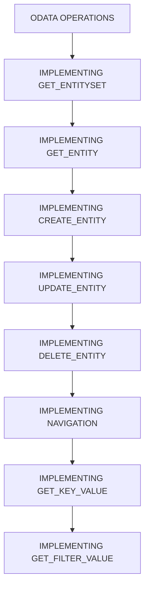

# 🌸 SOMMAIRE — ODATA OPERATIONS

## 🌺 OBJECTIFS DU COURS

- [ ] Comprendre la progression générale du cours.
- [ ] Identifier l’ordre conseillé des chapitres.
- [ ] Retrouver rapidement une notion précise.

## 🌺 PARCOURS

> [!IMPORTANT]
> Suivre les chapitres dans l’ordre numérique, sauf révision ciblée d’une notion déjà étudiée.

## 🌺 CHAPITRES

- [IMPLEMENTING GET_ENTITYSET](<./01 - 🍧 IMPLEMENTING GET_ENTITYSET.md>)
- [IMPLEMENTING GET_ENTITY](<./02 - 🍧 IMPLEMENTING GET_ENTITY.md>)
- [IMPLEMENTING CREATE_ENTITY](<./03 - 🍧 IMPLEMENTING CREATE_ENTITY.md>)
- [IMPLEMENTING UPDATE_ENTITY](<./04 - 🍧 IMPLEMENTING UPDATE_ENTITY.md>)
- [IMPLEMENTING DELETE_ENTITY](<./05 - 🍧 IMPLEMENTING DELETE_ENTITY.md>)
- [IMPLEMENTING NAVIGATION](<./06 - 🍧 IMPLEMENTING NAVIGATION.md>)
- [IMPLEMENTING GET_KEY_VALUE](<./07 - 🍧 IMPLEMENTING GET_KEY_VALUE.md>)
- [IMPLEMENTING GET_FILTER_VALUE](<./08 - 🍧 IMPLEMENTING GET_FILTER_VALUE.md>)

Afficher la méthode de travail

1. Lire les objectifs du chapitre.
2. Étudier le schéma Mermaid.
3. Reproduire les exemples.
4. Réaliser l’exercice sans consulter la correction.
5. Valider l’auto-évaluation.

## 🌺 RÉSUMÉ

> - Ce sommaire représente le parcours du cours **ODATA OPERATIONS**.
> - Les liens pointent vers les chapitres conservés dans leur emplacement d’origine.
