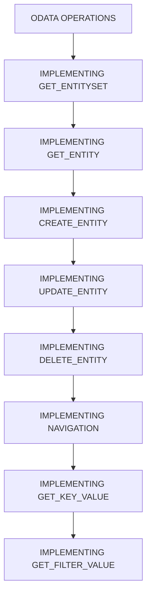

# 🌸 SOMMAIRE — ODATA OPERATIONS

## 🌺 OBJECTIFS DU COURS

- [ ] Comprendre la progression générale du cours.
- [ ] Identifier l’ordre conseillé des chapitres.
- [ ] Retrouver rapidement une notion précise.

## 🌺 PARCOURS

> [!IMPORTANT]
> Suivre les chapitres dans l’ordre numérique, sauf révision ciblée d’une notion déjà étudiée.

## 🌺 CHAPITRES

- [IMPLEMENTING GET_ENTITYSET](<./01 - 🍧 IMPLEMENTING GET_ENTITYSET.md>)
- [IMPLEMENTING GET_ENTITY](<./02 - 🍧 IMPLEMENTING GET_ENTITY.md>)
- [IMPLEMENTING CREATE_ENTITY](<./03 - 🍧 IMPLEMENTING CREATE_ENTITY.md>)
- [IMPLEMENTING UPDATE_ENTITY](<./04 - 🍧 IMPLEMENTING UPDATE_ENTITY.md>)
- [IMPLEMENTING DELETE_ENTITY](<./05 - 🍧 IMPLEMENTING DELETE_ENTITY.md>)
- [IMPLEMENTING NAVIGATION](<./06 - 🍧 IMPLEMENTING NAVIGATION.md>)
- [IMPLEMENTING GET_KEY_VALUE](<./07 - 🍧 IMPLEMENTING GET_KEY_VALUE.md>)
- [IMPLEMENTING GET_FILTER_VALUE](<./08 - 🍧 IMPLEMENTING GET_FILTER_VALUE.md>)

Afficher la méthode de travail

1. Lire les objectifs du chapitre.
2. Étudier le schéma Mermaid.
3. Reproduire les exemples.
4. Réaliser l’exercice sans consulter la correction.
5. Valider l’auto-évaluation.

## 🌺 RÉSUMÉ

## 🌺 CONVENTIONS DE TEST DU MODULE

- Client de test : transaction `/IWFND/GW_CLIENT`.
- URI de base : `/sap/opu/odata/SAP/<SERVICE>/`.
- Source des noms, clés et types : `/sap/opu/odata/SAP/<SERVICE>/$metadata`.
- Lecture : `GET`, sans corps ; `Accept: application/json` est recommandé pour lire facilement la réponse.
- Écriture : `POST`, `PATCH` ou `PUT`, `DELETE` ; récupérer d'abord un token avec `X-CSRF-Token: Fetch`, puis renvoyer le token dans la même session.
- Corps JSON : ajouter `Content-Type: application/json`.
- Diagnostic : contrôler le statut HTTP et consulter `/IWFND/ERROR_LOG` pour une erreur Gateway.

La casse des noms de propriétés et d'EntitySet doit correspondre exactement au modèle exposé. Les valeurs `<SERVICE>`, `<ID>` et les payloads du cours sont des paramètres pédagogiques à remplacer.

## 🌺 SOURCES DE VÉRIFICATION

- SAP SE, *SAP Gateway Client*, documentation SAP Gateway Foundation, consultée le 4 août 2026 : https://help.sap.com/docs/ABAP_PLATFORM/68bf513362174d54b58cddec28794093/062dfe50645c741ae10000000a423f68.html
- SAP SE, *SAP Gateway, REST and OData*, SAP Gateway Foundation 2025 FPS01, février 2026 : https://help.sap.com/docs/ABAP_PLATFORM_NEW/68bf513362174d54b58cddec28794093/ecaeea50ca692309e10000000a445394.html
- SAP SE, *Testing the GET_ENTITY Implementations and Navigation Functionality*, documentation SAP Mobile Platform SDK, consultée le 4 août 2026 : https://help.sap.com/docs/SAP_MOBILE_PLATFORM_SDK_31/42dc90f1e1ed45d9aafad60c80646d10/7c04906a70061014a7c8aab0e1e4a3ff.html

> - Ce sommaire représente le parcours du cours **ODATA OPERATIONS**.
> - Les liens pointent vers les chapitres conservés dans leur emplacement d’origine.
