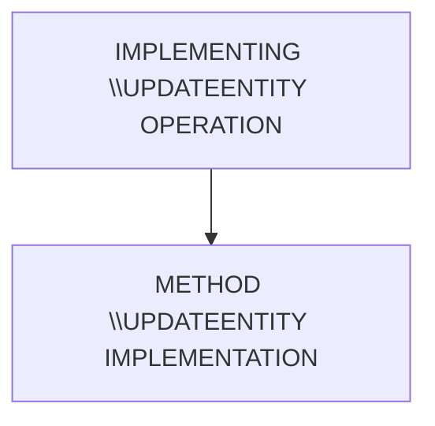

# 🌸 IMPLEMENTING \*\_UPDATE_ENTITY OPERATION

## 🌺 OBJECTIFS

- [ ] Expliquer le rôle de **IMPLEMENTING \*\_UPDATE_ENTITY OPERATION** dans le contexte présenté.
- [ ] Comprendre **method \_update_entity implémentation**.
- [ ] Appliquer la notion dans un exemple simple.
- [ ] Reconnaître les erreurs fréquentes et les limites de l’approche.

## 🌺 VUE D'ENSEMBLE



## 🌺 METHOD \*\_UPDATE_ENTITY IMPLÉMENTATION

### 🍧 PRÉREQUIS - TRANSACTION SEGW

> [!WARNING]
> L'`EntitySet` ciblée doit être `Updatable` !

### 🍧 TRANSACTION SE24

> [!NOTE]
> Classe ciblée : `ZCL_<PROJECTNAME>_DPC_EXT`


### 🍧 METHOD PARAMETERS

| 🍧 Paramètre            | 🍧 Catégorie | 🍧 Méthode Catégorie | 🍧 Type réf.                          |
| ----------------------- | ------------ | -------------------- | ------------------------------------- |
| IV_ENTITY_NAME          | Importing    | Type                 | STRING                                |
| IV_ENTITY_SET_NAME      | Importing    | Type                 | STRING                                |
| IV_SOURCE_NAME          | Importing    | Type                 | STRING                                |
| IT_KEY_TAB              | Importing    | Type                 | /IWBEP/T_MGW_NAME_VALUE_PAIR          |
| IO_TECH_REQUEST_CONTEXT | Importing    | Type Ref To          | /IWBEP/IF_MGW_REQ_ENTITY_U            |
| IT_NAVIGATION_PATH      | Importing    | Type                 | /IWBEP/T_MGW_NAVIGATION_PATH          |
| IO_DATA_PROVIDER        | Importing    | Type Ref To          | /IWBEP/IF_MGW_ENTRY_PROVIDER          |
| ER_ENTITY               | Exporting    | Type                 | ZCL_ZFGI_GATEWAY_DEMO_MPC=>TS_PRODUCT |

> [!NOTE]
> 🍧 `IV_ENTITY_NAME` (STRING)
>
> - Nom de l’Entity OData cible pour la mise à jour.
> - Exemple : `Product`.
> - Identification logique de l’entité à modifier.

> [!NOTE]
> 🍧 `IV_ENTITY_SET_NAME` (STRING)
>
> - Nom de l’EntitySet sur laquelle le PATCH/PUT est exécuté.
> - Exemple : `Products`.
> - Correspond au segment de l’URL utilisé pour la requête UPDATE.

> [!NOTE]
> 🍧 `IV_SOURCE_NAME` (STRING)
>
> - Nom de la source d’appel.
> - Utilisé surtout pour les scénarios de navigation ou de réutilisation.
> - Rarement exploité dans un UPDATE simple.

> [!NOTE]
> 🍧 `IT_KEY_TAB` (`/IWBEP/T_MGW_NAME_VALUE_PAIR`)
>
> - Contient les clés de l’entité à mettre à jour.
> - Exemple URL : `Products(ProductID='100')`
> - Paramètre central pour identifier la ligne à modifier.

> [!NOTE]
> 🍧 `IO_TECH_REQUEST_CONTEXT` (`/IWBEP/IF_MGW_REQ_ENTITY_U`)
>
> - Contexte technique de la requête UPDATE.
> - Permet l’accès aux headers HTTP, utilisateur, et autres informations techniques.
> - Usage strictement technique.

> [!NOTE]
> 🍧 `IT_NAVIGATION_PATH` (`/IWBEP/T_MGW_NAVIGATION_PATH`)
>
> - Chemin de navigation OData.
> - Exemple : `Orders('1')/Items('10')`
> - Indique depuis quelle entité parente la modification est effectuée.

> [!NOTE]
> 🍧 `IO_DATA_PROVIDER` (`/IWBEP/IF_MGW_ENTRY_PROVIDER`)
>
> - Fournisseur des données envoyées par le client.
> - Contient le payload PATCH/PUT avec les champs à modifier.
> - Source principale des valeurs de mise à jour.

> [!NOTE]
> 🍧 `ER_ENTITY` (Type spécifique MPC)
>
> - Entité mise à jour et retournée au consumer OData.
> - Contient les valeurs finales après modification.
> - Résultat principal de la méthode UPDATE_ENTITY.

### 🍧 BUSINESSPARTNERS_UPDATE_ENTITY METHOD INITIAL CODE

```abap
  METHOD businesspartners_update_entity.
**TRY.
*CALL METHOD SUPER->BUSINESSPARTNERS_UPDATE_ENTITY
*  EXPORTING
*    IV_ENTITY_NAME          =
*    IV_ENTITY_SET_NAME      =
*    IV_SOURCE_NAME          =
*    IT_KEY_TAB              =
**    io_tech_request_context =
*    IT_NAVIGATION_PATH      =
**    io_data_provider        =
**  IMPORTING
**    er_entity               =
*    .
**  CATCH /iwbep/cx_mgw_busi_exception.
**  CATCH /iwbep/cx_mgw_tech_exception.
**ENDTRY.
  ENDMETHOD.
```

### 🍧 METHOD IMPLÉMENTATION

```abap
METHOD businesspartners_update_entity.

*&---------------------------------------------------------------------*
*& 1. PRODUCTSET_GET_ENTITY METHOD IMPLEMENTATION
*&---------------------------------------------------------------------*
*& MOD_20251431 - SEGW GATEWAY & ODATA BACKEND
*&    └─ 10 - ODATA OPERATIONS
*&       └─ 04 - IMPLEMENTING UPDATE_ENTITY
*&---------------------------------------------------------------------*

  DATA: ls_request     TYPE zcl_zfgi_gateway_demo_mpc=>ts_businesspartner,
        ls_bp_id       TYPE bapi_epm_bp_id,
        ls_headerdata  TYPE bapi_epm_bp_header,
        ls_headerdatax TYPE bapi_epm_bp_headerx,
        lt_return      TYPE TABLE OF bapiret2.

  "--- Get key
  io_tech_request_context->get_converted_keys(
    IMPORTING
      es_key_values = ls_request
  ).
  ls_bp_id-bp_id = ls_request-businesspartnerid.

  "--- Get request data
  io_data_provider->read_entry_data(
    IMPORTING
      es_data = er_entity ).

  "--- The URI key is authoritative
  er_entity-businesspartnerid = ls_request-businesspartnerid.

  "--- Map request fields to function module parameters
  ls_headerdata = VALUE #(
                    bp_id         = er_entity-businesspartnerid
                    bp_role       = er_entity-businesspartnerrole
                    email_address = er_entity-emailaddress
                    company_name  = er_entity-companyname
                    currency_code = er_entity-currencycode
                    city          = er_entity-city
                    street        = er_entity-street
                    country       = er_entity-country
                    address_type  = er_entity-addresstype ).

  "--- Map constant value to function module parameters
  ls_headerdatax-bp_id         = er_entity-businesspartnerid.
  ls_headerdatax-email_address = 'X'.
  ls_headerdatax-company_name  = 'X'.
  ls_headerdatax-currency_code = 'X'.
  ls_headerdatax-city          = 'X'.
  ls_headerdatax-street        = 'X'.
  ls_headerdatax-country       = 'X'.
  ls_headerdatax-address_type  = 'X'.
  ls_headerdatax-bp_role       = 'X'.

  "--- Change data
  CALL FUNCTION 'BAPI_EPM_BP_CHANGE'
    EXPORTING
      bp_id       = ls_bp_id
      headerdata  = ls_headerdata
      headerdatax   = ls_headerdatax
      persist_to_db = abap_true
    TABLES
      return      = lt_return.

  IF line_exists( lt_return[ type = 'E' ] )
     OR line_exists( lt_return[ type = 'A' ] ).
    "--- Message Container
    mo_context->get_message_container( )->add_messages_from_bapi( lt_return ).
    RAISE EXCEPTION TYPE /iwbep/cx_mgw_busi_exception
      EXPORTING
        textid            = /iwbep/cx_mgw_busi_exception=>business_error
        message_container = mo_context->get_message_container( ).
  ENDIF.

  "--- Return the updated representation
  er_entity-businesspartnerid = ls_bp_id-bp_id.

ENDMETHOD.
```

### 🍧 TEST DANS `/IWFND/GW_CLIENT`

Récupérer d'abord un token CSRF comme indiqué dans `CREATE_ENTITY`, puis conserver la même session.

| Élément | Valeur |
| --- | --- |
| Méthode HTTP | `PATCH` pour une modification partielle ; `PUT` pour un remplacement complet |
| URI | `/sap/opu/odata/SAP/<SERVICE>/BusinessPartners('<ID>')` |
| Headers | `Content-Type: application/json`, `Accept: application/json`, `X-CSRF-Token: <TOKEN>` |
| Corps PATCH minimal | `{ "City": "Lyon" }` |
| Résultat attendu | `204 No Content` ou `200 OK`, selon l'implémentation |

La clé de l'URI reste la référence. Le payload ne doit pas pouvoir modifier l'identifiant. Si le service utilise les ETags, ajouter `If-Match: <ETAG>` ; `If-Match: *` ne doit être utilisé que pour un exercice sans contrôle de concurrence.

### 🍧 METHOD EXCEPTION

> [!IMPORTANT]
> Les erreurs d'une class method doivent être `Raise` à l'aide des `Exception Classes`
>
> - `/IWBEP/CX_MGW_BUSI_EXCEPTION` pour les erreurs de `logique métier`
> - `/IWBEP/CX_MGW_TECH_EXCEPTION` pour les `exceptions techniques`

> [!IMPORTANT]
> Les `Exception Classes` offrent plusieurs paramètres pour fournir des informations plus détaillées sur l'erreur.
> Par exemple, le paramètre `message_container` permet de regrouper plusieurs messages dans un seul objet. L'attribut `mo_context` de la `DPC` fournit un tel conteneur de messages, qui peut être rempli à l'aide de différentes Methods, comme `add_message_from_bapi()`, en attendant le paramètre de retour d'une BAPI.

---

[^1]: Un Reuse Unit est une implémentation standard encapsulée (méthodes utilitaires, classes framework, routines générées) que le runtime Gateway peut appeler pour exécuter une opération OData sans code spécifique.

## 🌺 RÉSUMÉ

> - Savoir utiliser **method \*\_update_entity implémentation** dans le contexte présenté.

<details>
<summary>🍧 Afficher l’auto-évaluation</summary>

- [ ] Je peux définir **IMPLEMENTING \*\_UPDATE_ENTITY OPERATION** avec mes propres mots.
- [ ] Je peux expliquer **method \*\_update_entity implementation** sans relire le chapitre.
- [ ] Je peux appliquer ou illustrer **un exemple concret** dans un exemple simple.
- [ ] Je peux identifier au moins une erreur fréquente ou une limite liée à cette notion.

</details>
