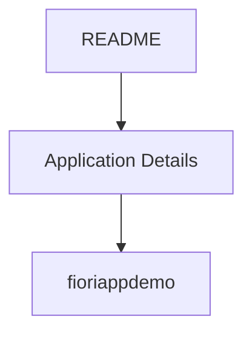

# 🌸 README

## 🌺 OBJECTIFS

- [ ] Expliquer le rôle de **README** dans le contexte présenté.
- [ ] Comprendre **application details**.
- [ ] Mettre en œuvre **fiori_app_demo** dans un exemple guidé.
- [ ] Reconnaître les erreurs fréquentes et les limites de l’approche.
## 🌺 VUE D'ENSEMBLE



> [!IMPORTANT]
> Vérifier la version SAPUI5 ciblée par l’application. La disponibilité d’une API, d’une propriété ou d’un événement peut dépendre de cette version.


## 🌺 Application Details
|               |
| ------------- |
|**Generation Date and Time**<br>Wed Jun 03 2026 11:56:37 GMT+0200 (Central European Summer Time)|
|**App Generator**<br>SAP Fiori Application Generator|
|**App Generator Version**<br>1.22.0|
|**Generation Platform**<br>Visual Studio Code|
|**Template Used**<br>Basic V2|
|**Service Type**<br>SAP System (ABAP On-Premise)|
|**Service URL**<br>https://s4hhost1.stms.fr:44300/sap/opu/odata/sap/ZFIORI_DEMO_SRV|
|**Module Name**<br>fiori_app_demo|
|**Application Title**<br>FIORI APP DEMO|
|**Namespace**<br>fr.stms|
|**UI5 Theme**<br>sap_horizon|
|**UI5 Version**<br>1.120.14|
|**Enable TypeScript**<br>False|
|**Add Eslint configuration**<br>True, see https://www.npmjs.com/package/@sap-ux/eslint-plugin-fiori-tools#rules for the eslint rules.|

## 🌺 fiori_app_demo

Mon app Demo Fiori

### 🍧 Starting the generated app

-   This app has been generated using the SAP Fiori tools - App Generator, as part of the SAP Fiori tools suite.  To launch the generated application, run the following from the generated application root folder:

```
    npm start
```

- It is also possible to run the application using mock data that reflects the OData Service URL supplied during application generation.  In order to run the application with Mock Data, run the following from the generated app root folder:

```
    npm run start-mock
```

#### 💮 Pre-requisites:

1. Active NodeJS LTS (Long Term Support) version and associated supported NPM version.  (See https://nodejs.org)

## 🌺 RÉSUMÉ

> - Savoir utiliser **application details** dans le contexte présenté.
> - **Fiori_app_demo :** 1.

<details>
<summary>🍧 Afficher l’auto-évaluation</summary>

- [ ] Je peux définir **README** avec mes propres mots.
- [ ] Je peux expliquer **application details** sans relire le chapitre.
- [ ] Je peux appliquer ou illustrer **fiori_app_demo** dans un exemple simple.
- [ ] Je peux identifier au moins une erreur fréquente ou une limite liée à cette notion.

</details>
