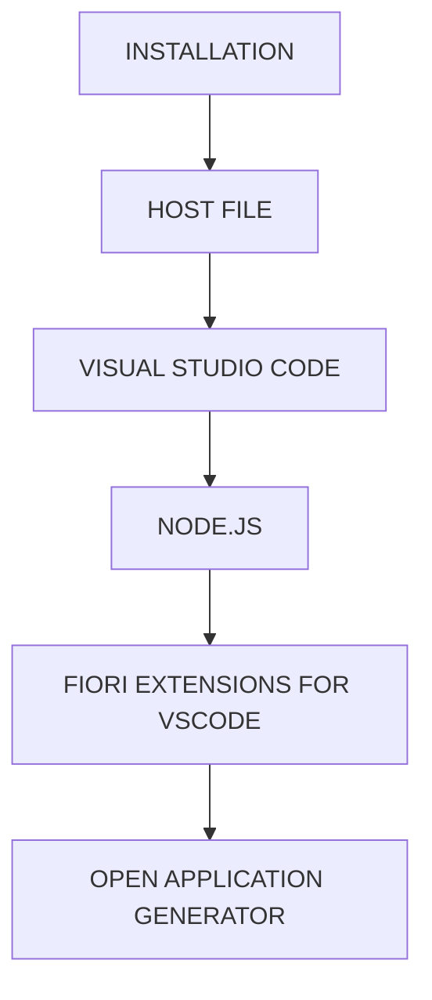

# 🌸 INSTALLATION

## 🌺 OBJECTIFS

- [ ] Expliquer le rôle de **INSTALLATION** dans le contexte présenté.
- [ ] Comprendre **host file**.
- [ ] Mettre en œuvre **visual studio code** dans un exemple guidé.
- [ ] Reconnaître les erreurs fréquentes et les limites de l’approche.

## 🌺 VUE D'ENSEMBLE

## 🌺 HOST FILE

> [!IMPORTANT]
> Modifier le fichier hosts en mode Administrateur
>
> - Path : C:\Windows\System32\drivers\etc
> - Elements à rajouter : (a demander au formateur)

## 🌺 VISUAL STUDIO CODE

> [!IMPORTANT]
> `Visual Studio Code` (VSCode) est un éditeur de code source puissant et léger, disponible pour Windows, macOS et Linux. Il prend en charge nativement de nombreux langages tels que JavaScript, TypeScript, `NodeJS`, etc. Installé localement sur votre système, il se lance rapidement, permettant ainsi aux développeurs de se concentrer sur leurs problèmes sans se soucier des bugs.

Fonctionnalités :

- Saisie semi-automatique du code avec IntelliSense
- Options de débogage
- Fonctionnalités d'édition avancées
- Navigation et refactorisation du code

[VSCode - Téléchargement et Installation](https://code.visualstudio.com/)

## 🌺 NODE.JS

> [!IMPORTANT]
> `Visual Studio Code` utilise de nombreux packages et modules `NodeJS`, même pour le développement d'interfaces utilisateur SAP ; je recommande donc d'installer `NodeJS` en même temps.

[NodeJS - Téléchargement et Installation](https://nodejs.org/en/)

## 🌺 FIORI EXTENSIONS FOR VSCODE

> [!IMPORTANT]
> Nous utiliserons `SAP Fiori Tools`. C'est une extension disponible pour `SAP Business Application Studio` et `Visual Studio Code` qui nous aide à développer des applications `UI5/Fiori`.

1. Ouvrez `Visual Studio Code`. Dans l'onglet de gauche, cliquez sur l'icône Extensions :

   

2. Recherchez `SAP Fiori Tools` et installer le.

   

## 🌺 OPEN APPLICATION GENERATOR

Une fois tous les paquets installés, appuyez sur `Ctrl + Maj + P`. La `Palette de commandes` s'ouvrira, vous permettant d'exécuter de nombreuses commandes.

Sélectionnez `Fiori: Open Application Generator`

`Visual Studio Code` propose de nombreux `Generators`, véritables assistants pour la création d'applications. Au départ, aucun générateur ne sera peut-être disponible. Par défaut, nous installerons tous les `Generators`.

## 🌺 RÉSUMÉ

> - Savoir utiliser **host file** dans le contexte présenté.
> - Savoir utiliser **visual studio code** dans le contexte présenté.
> - Savoir utiliser **node.js** dans le contexte présenté.

🍧 Afficher l’auto-évaluation

- [ ] Je peux définir **INSTALLATION** avec mes propres mots.
- [ ] Je peux expliquer **host file** sans relire le chapitre.
- [ ] Je peux appliquer ou illustrer **visual studio code** dans un exemple simple.
- [ ] Je peux identifier au moins une erreur fréquente ou une limite liée à cette notion.

