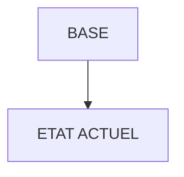

# 🌸 BASE

## 🌺 OBJECTIFS

- [ ] Expliquer le rôle de **BASE** dans le contexte présenté.
- [ ] Comprendre **etat actuel**.
- [ ] Appliquer la notion dans un exemple simple.
- [ ] Reconnaître les erreurs fréquentes et les limites de l’approche.

## 🌺 VUE D'ENSEMBLE



> [!IMPORTANT]
> Vérifier la version SAPUI5 ciblée par l’application. La disponibilité d’une API, d’une propriété ou d’un événement peut dépendre de cette version.

## 🌺 ETAT ACTUEL

En l'état actuel, vous devriez avoir :

```
appdemofgi/
│
├── node_modules/
│
├── webapp/
│   │
│   ├── controller/
│   │   ├── App.controller.js
│   │   └── Home.controller.js
│   │
│   ├── css/
│   │   └── style.css
│   │
│   ├── i18n/
│   │   └── i18n.properties
│   │
│   ├── localService/                   # N'apparaît pas si aucun service n'a été défini lors de la génération de l'app
│   │   └── mainService/
│   │       └── metadata.xml
│   │
│   ├── model/
│   │   └── models.js
│   │
│   ├── view/
│   │   ├── App.view.xml
│   │   └── Home.view.xml
│   │
│   ├── Component.js
│   ├── index.html
│   └── manifest.json
│
├── .gitignore
├── package-lock.json
├── package.json
├── README.md
├── ui5-local.yaml
├── ui5-mock.yaml
└── ui5.yaml
```


## 🌺 RÉSUMÉ

> - **Etat actuel :** En l'état actuel, vous devriez avoir :

<details>
<summary>🍧 Afficher l’auto-évaluation</summary>

- [ ] Je peux définir **BASE** avec mes propres mots.
- [ ] Je peux expliquer **etat actuel** sans relire le chapitre.
- [ ] Je peux appliquer ou illustrer **un exemple concret** dans un exemple simple.
- [ ] Je peux identifier au moins une erreur fréquente ou une limite liée à cette notion.

</details>
